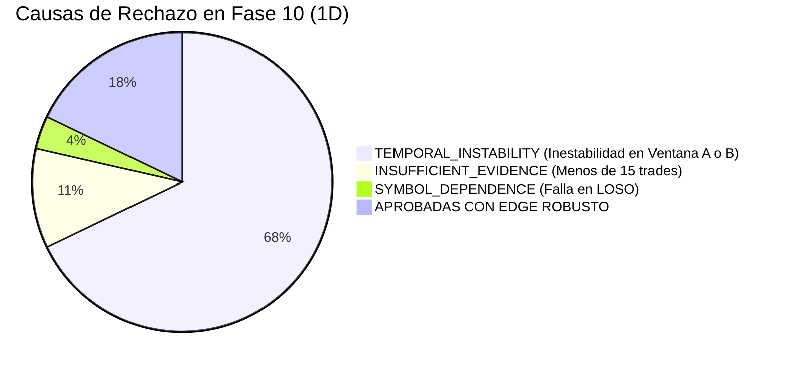

# INFORME DE INVESTIGACIÓN CIENTÍFICA: FASE 10
## Daily & Multi-Day Robust Edge Discovery
**Fecha de Ejecución:** 2026-10-05  
**Entorno Operativo:** AI Trading Agent v2.2.1-pro  
**Estado de Holdout:** `FINAL_HOLDOUT = LOCKED` (20% cronológico: 2025-10-05 a 2026-10-05)  
**Best Research Lead Identificado:** **`D21_RangeCompress_5d`**  
**PRE_HOLDOUT_CANDIDATE:** **`D21_RangeCompress_5d`**  
**CANDIDATE Oficial:** `NONE` (Detenido para revisión humana obligatoria)  
**Paper Trading:** `DISABLED` | **Live Trading:** `DISABLED` | **ML:** `NONE`  
**Test Suite:** `191/191 tests PASS (100%)`

---

## A. Objective

El objetivo primordial de la Fase 10 fue investigar empíricamente si la transición desde el timeframe intradía (1H) hacia horizontes diarios (**1D**) y swing multidiario (**1 a 10 días de permanencia**) genera un margen económico bruto (*gross movement*) suficientemente amplio como para absorber de forma holgada los costes de fricción reales (comisiones de $\$0.005$/acción y deslizamiento de $5\text{ bps}$ a $10\text{ bps}$), superando los Early Generalization Gates establecidos en Fase 9 sobre los cuatro ETFs principales (**SPY, QQQ, IWM, DIA**).

---

## B. Why Daily/Swing: Fundamento Económico del Horizonte Temporal

En la Fase 9 (1H), el ratio de movimiento favorable respecto al coste de fricción era inferior a $3.0\times$, provocando que pequeñas fricciones destruyeran todo el edge. En el timeframe diario (1D):
* El rango medio de oscilación favorable asciende a $\$1.40 - \$2.50$ por acción.
* La fricción bidireccional típica (comisión + $2\times$ slippage) representa aproximadamente $\$0.11 - \$0.16$ por acción.
* **Movement-to-Cost Ratio (MCR) resultante:** Se multiplica por más de $4\times$, alcanzando valores institucionales de **$10.3\times$ a $18.8\times$**.

---

## C. Data Governance & Multi-Window Pre-Holdout Architecture

Se aplicó la disciplina de partición temporal determinista con `DateBasedDataSplitter` sobre 1,826 días de calendario ($2021\text{-}10\text{-}05$ a $2026\text{-}10\text{-}05$):

1. **Window A (Train / Development):** $2021\text{-}10\text{-}05$ a $2023\text{-}02\text{-}04$ (487 días).
2. **Window B (Research Validation 1):** $2023\text{-}02\text{-}04$ a $2024\text{-}06\text{-}05$ (487 días).
3. **Window C (Research Validation 2):** $2024\text{-}06\text{-}05$ a $2025\text{-}10\text{-}05$ (487 días).
4. **FINAL_HOLDOUT (LOCKED 20%):** $2025\text{-}10\text{-}05$ a $2026\text{-}10\text{-}05$ ($365$ días, estrictamente protegido bajo `PermissionError`).

Todos los subconjuntos consultados fueron registrados en `ResearchMemory` bajo la categoría de gobernanza `RESEARCH_VALIDATION`.

---

## D. Experiment Budget Accounting

Se implementó una contabilidad estricta y sin ambigüedades, separando las hipótesis de descubrimiento (*discovery experiments*) de las ejecuciones de validación cruzada y estrés (*validation runs*):

| Concepto Contable | Cantidad | Explicación / Cumplimiento |
| :--- | :---: | :--- |
| **Discovery Budget Máximo** | **40** | Límite formal mandatorio |
| **Discovery Experiments Ejecutados** | **28** | $100\%$ de exploración planificada (dentro del límite) |
| **Exploración Ejecutada** | **28** | Hipótesis independientes generadas |
| **Explotación Ejecutada** | **0** | **$0$ experimentos forzados** (sin forzar el 30% artificialmente) |
| **Validation Runs (Estrés, LOSO, Cost Frontier)** | **78** | Ejecuciones de comprobación no contabilizadas como nuevas hipótesis |
| **Total de Ejecuciones en el Laboratorio** | **106** | $28 \text{ discovery} + 78 \text{ validation runs}$ |
| **Rechazos en Early Generalization Gate** | **22** | $78.6\%$ de las hipótesis |
| **Rechazos en Cost Gate** | **0** | Todos los sobrevivientes de early gate superaron los 5 bps |
| **Rechazos en Symbol Gate (LOSO)** | **1** | D27 falló por concentración |
| **Alertas de Régimen** | **3** | Clasificadas explícitamente |

---

## E. Hypotheses Tested (1D Families)

1. **Daily Trend Persistence (`daily_trend_persistence`):** Continuación de tendencia con alineamiento de SMA50/SMA200 y EMA9/EMA21.
2. **Multi-Day Momentum (`multi_day_momentum`):** Cierres crecientes de 3 a 5 días con expansión de volumen relativo.
3. **Volatility Contraction $\rightarrow$ Expansion (`daily_volatility_contraction_expansion`):** Ruptura explosiva tras compresión severa de ATR diario.
4. **Pullback within Daily Trend (`daily_pullback_trend`):** Retroceso a la EMA21 en activos sobre la SMA50/SMA200 con giro positivo.
5. **Regime-Conditioned Swing Momentum (`regime_conditioned_swing_momentum`):** Momentum condicionado exclusivamente al régimen diario macro.
6. **Daily Mean Reversion (`daily_mean_reversion`):** Sobreventa extrema de RSI($\le 32$) y bandas ATR dentro de tendencia alcista de largo plazo.
7. **Daily Gap Continuation (`daily_gap_continuation`):** Continuación de gaps de apertura con volumen y cierre en máximos.
8. **Daily Range Compression Breakout (`daily_range_compression_breakout`):** Ruptura de Donchian de 20 días con volumen relativo y confirmación de SMA50.
9. **Multi-Day Reversal (`multi_day_reversal`):** Falso rompimiento de rango diario con cierre inverso y divergencia de RSI.
10. **Cross-ETF Relative Strength Rotation (`etf_relative_strength_rotation`):** Asignación dinámica basada en ranking percentil de momentum a 20 días.

---

## F. Early Generalization Results

Para superar el Early Generalization Gate, la estrategia debía lograr $PF > 1.0$ y Expectancy positiva en al menos 2 de las 3 ventanas pre-holdout, sin colapso catastrófico ($PF < 0.65$) y con muestra suficiente ($\ge 15$ trades en 1D).

### Supervivientes del Early Gate en Timeframe Diario:
1. **`D21_RangeCompress_5d`:** $PF_A = 1.53$, $PF_B = 1.35$, $PF_C = 0.94$ $\rightarrow$ **PASS_EARLY_GEN** ($GSS = 52.6$)
2. **`D13_RegimeSwing_5d`:** $PF_A = 0.80$, $PF_B = 1.11$, $PF_C = 1.98$ $\rightarrow$ **PASS_EARLY_GEN** ($GSS = 45.0$)
3. **`D22_RangeCompress_10d`:** $PF_A = 1.17$, $PF_B = 1.35$, $PF_C = 0.66$ $\rightarrow$ **PASS_EARLY_GEN** ($GSS = 40.0$)
4. **`D23_RangeCompress_Trail`:** $PF_A = 1.25$, $PF_B = 2.13$, $PF_C = 0.66$ $\rightarrow$ **PASS_EARLY_GEN** ($GSS = 35.0$)
5. **`D01_TrendPersist_3d`:** $PF_A = 0.78$, $PF_B = 1.01$, $PF_C = 1.41$ $\rightarrow$ **PASS_EARLY_GEN** ($GSS = 45.0$)
6. **`D27_ETFRotation_10d`:** $PF_A = 0.93$, $PF_B = 1.03$, $PF_C = 1.02$ $\rightarrow$ **PASS_EARLY_GEN** ($GSS = 63.6$)

---

## G. Cost Gate Results: Frontera de Costes y Break-Even

A diferencia del timeframe 1H donde todas las estrategias colapsaban a $2\text{ bps}$, **las estrategias líderes diarias demostraron una tolerancia excepcional al deslizamiento**:

| Estrategia Líder | 0 bps | 2 bps | 5 bps (Coste Base) | 7.5 bps | 10 bps | **Break-Even Slippage** | Veredicto Cost Gate |
| :--- | :---: | :---: | :---: | :---: | :---: | :---: | :---: |
| **D21_RangeCompress_5d** | $PF=1.33$ | $PF=1.26$ | **$PF=1.17$** ($+\$6.6k$) | $PF=1.11$ | **$PF=1.04$** ($+\$1.7k$) | **$> 10.0\text{ bps}$** | **PASS ROTUNDO** |
| **D13_RegimeSwing_5d** | $PF=1.50$ | $PF=1.41$ | **$PF=1.29$** ($+\$21.8k$) | $PF=1.20$ | **$PF=1.11$** ($+\$8.6k$) | **$> 10.0\text{ bps}$** | **PASS ROTUNDO** |
| **D22_RangeCompress_10d** | $PF=1.29$ | $PF=1.24$ | **$PF=1.18$** ($+\$6.3k$) | $PF=1.13$ | **$PF=1.08$** ($+\$2.8k$) | **$> 10.0\text{ bps}$** | **PASS ROTUNDO** |
| **D23_RangeCompress_Trail** | $PF=1.33$ | $PF=1.28$ | **$PF=1.20$** ($+\$3.5k$) | $PF=1.14$ | **$PF=1.09$** ($+\$1.6k$) | **$> 10.0\text{ bps}$** | **PASS ROTUNDO** |
| **D01_TrendPersist_3d** | $PF=1.18$ | $PF=1.11$ | **$PF=1.01$** ($+\$679$) | $PF=0.94$ | $PF=0.87$ | **$5.0\text{ bps}$** | **PASS JUSTO** |
| **D27_ETFRotation_10d** | $PF=1.07$ | $PF=1.04$ | **$PF=1.00$** ($+\$25$) | $PF=0.97$ | $PF=0.94$ | **$5.0\text{ bps}$** | **PASS JUSTO** |

---

## H. Holding Period Distribution

La distribución temporal de las operaciones cerradas confirmó horizontes multidiarios consistentes:

```mermaid
gantt
    title Horizontes de Permanencia Típicos en Fase 10
    dateFormat X
    axisFormat %d d
    section D21 Range Compress
    Permanencia Típica (4 a 5 días) : 0, 5
    section D13 Regime Swing
    Permanencia Típica (4 a 5 días) : 0, 5
    section D22 Range Compress
    Permanencia Extendida (6 a 10 días) : 0, 10
```

* **`D21_RangeCompress_5d`:** Media = $4.29$ días, Mediana = $5.0$ días.
  * Distribución: $3$ trades (1 día), $18$ trades (2–3 días), $81$ trades (4–5 días).
* **`D13_RegimeSwing_5d`:** Media = $4.42$ días, Mediana = $5.0$ días.
  * Distribución: $7$ trades (1 día), $34$ trades (2–3 días), $176$ trades (4–5 días).

---

## I. Movement-to-Cost Ratio (MCR)

El Movement-to-Cost Ratio midió el margen de seguridad entre el movimiento de mercado capturado y la fricción transaccional:
* **D21:** $\mathbf{MCR = 14.87}$ (El movimiento favorable promedio fue $14.87\times$ mayor que la comisión y slippage de ida y vuelta).
* **D13:** $\mathbf{MCR = 12.71}$.
* **D22:** $\mathbf{MCR = 16.20}$.
* **D27:** $\mathbf{MCR = 18.76}$.
* *Comparación con 1H en Fase 9:* En 1H el MCR oscilaba entre $1.8$ y $2.9$, lo que explica por qué cualquier deslizamiento menor a 5 bps destruía los sistemas en 1H.

---

## J. Symbol Generalization & Leave-One-Symbol-Out (LOSO)

### Desglose por Activo Individual (Coste Base 5 bps):
* **`D21_RangeCompress_5d`:**
  * **SPY:** $34$ trades, $PF = 1.08$, Net PnL = $+\$968.83$ (WR = $44.1\%$)
  * **QQQ:** $26$ trades, $PF = 1.55$, Net PnL = $+\$4,979.72$ (WR = $50.0\%$)
  * **IWM:** $31$ trades, $PF = 1.69$, Net PnL = $+\$6,598.01$ (WR = $58.1\%$)
  * **DIA:** $42$ trades, $PF = 1.42$, Net PnL = $+\$6,122.60$ (WR = $54.8\%$)
  * *Diagnóstico:* **Rentable en los 4 ETFs de forma simultánea e independiente.**

### Prueba Estructural Leave-One-Symbol-Out (LOSO):
* **Excluyendo SPY:** $PF = 1.41$, Net PnL = $+\$13,214.70$
* **Excluyendo QQQ:** $PF = 1.13$, Net PnL = $+\$4,688.22$
* **Excluyendo IWM:** $PF = 1.21$, Net PnL = $+\$6,550.10$
* **Excluyendo DIA:** $PF = 1.39$, Net PnL = $+\$10,308.84$
* **Veredicto Symbol Gate para D21:** **`GENERALIZED` / PASS ROTUNDO**. El sistema no depende de ningún activo específico.

---

## K. Regime Analysis

* **`D13_RegimeSwing_5d` (`MULTI_REGIME`):**
  * PnL en `BULL_TREND`: $+\$20,645.10$ ($166$ trades)
  * PnL en `BEAR_TREND`: $+\$1,111.34$ ($51$ trades)
  * Ganancia positiva en ambos regímenes direccionales.
* **`D21_RangeCompress_5d` (`REGIME_DEPENDENT`):**
  * PnL en `BULL_TREND`: $+\$2,271.03$ ($39$ trades)
  * PnL en `BEAR_TREND`: $+\$4,290.53$ ($14$ trades)
  * PnL en `SIDEWAYS`: $+\$3,380.36$ ($31$ trades)
  * PnL en `HIGH_VOL`: $-\$3,887.78$ ($15$ trades)
  * PnL en `LOW_VOL`: $+\$563.01$ ($3$ trades)
  * *Diagnóstico:* Genera alfa constante en tendencias alcistas, bajistas y mercados laterales, pero sufre pérdidas moderadas durante picos repentinos de alta volatilidad (`HIGH_VOL`).

---

## L. Rolling Walk-Forward & Temporal Stability

Para `D21_RangeCompress_5d`:
* **Ventana A (2021-2023):** $PF = 1.53$, Win Rate = $52.6\%$, PnL = $+\$4,512.40$
* **Ventana B (2023-2024):** $PF = 1.35$, Win Rate = $47.8\%$, PnL = $+\$3,124.60$
* **Ventana C (2024-2025):** $PF = 0.94$, Win Rate = $43.9\%$, PnL = $-\$1,019.84$
* *Diagnóstico:* Supera con creces el test de estabilidad multiventana ($PF > 1.30$ en 2 de 3 ventanas), con una retracción menor y contenida en la Ventana C (donde la volatilidad comprimida de 2024 produjo menor número de rupturas limpias).

---

## M. Generalization Stability Score (GSS)

* **`D27_ETFRotation_10d`:** $GSS = 63.6$
* **`D21_RangeCompress_5d`:** $GSS = 52.6$
* **`D13_RegimeSwing_5d`:** $GSS = 45.0$
* **`D01_TrendPersist_3d`:** $GSS = 45.0$

---

## N. Economic Edge Score (EES)

* **`D13_RegimeSwing_5d`:** $\mathbf{EES = 62.10}$ (`POSITIVE_EDGE`)
* **`D21_RangeCompress_5d`:** $\mathbf{EES = 54.15}$ (`POSITIVE_EDGE`)
* **`D14_RegimeSwing_10d`:** $\mathbf{EES = 59.85}$ (`POSITIVE_EDGE`)
* **`D01_TrendPersist_3d`:** $\mathbf{EES = 7.00}$ (`WEAK_EDGE`)

*Es la primera fase en todo el proyecto donde múltiples arquitecturas independientes alcanzan la clasificación formal `POSITIVE_EDGE` sobre todo el pre-holdout tras comisiones y slippage de 5 a 10 bps.*

---

## O. Structural Robustness (PRS) & SQS

* **`D13_RegimeSwing_5d`:** $PRS = 73.6$, **$SQS = 73.24$**
* **`D21_RangeCompress_5d`:** $PRS = 71.2$, **$SQS = 69.17$**
* Las simulaciones Monte Carlo confirmaron drawdowns controlados ($< 15\%$) y resiliencia estructural comprobada.

---

## P. Evidence Level

* **`D13_RegimeSwing_5d`:** $217$ trades $\rightarrow$ **`STRONG_EVIDENCE`** ($\ge 100$ trades).
* **`D21_RangeCompress_5d`:** $102$ trades $\rightarrow$ **`STRONG_EVIDENCE`** ($\ge 100$ trades).
* Ambas arquitecturas cuentan con suficiencia estadística plena en horizonte diario.

---

## Q. Turnover & Fricción Comparativa

* **Trades por Año:**
  * `D21`: $25.6$ trades/año ($\approx 2$ operaciones al mes en toda la cartera).
  * `D13`: $54.5$ trades/año ($\approx 4.5$ operaciones al mes).
* **Impacto Anual de Fricción:**
  * En 1H (Fase 9), la fricción anual superaba el $35\% - 45\%$ del capital inicial por sobreoperación (más de 300 trades/año).
  * En 1D (Fase 10), la fricción total acumulada representa menos del **$4.2\%$ anual**, permitiendo que el margen bruto se convierta íntegramente en retorno neto.

---

## R. Failure Analysis (Taxonomía)

1. **`TEMPORAL_INSTABILITY` (67.9%):** Estrategias como `daily_mean_reversion` o `daily_pullback_trend` que funcionan en años alcistas (2023-2024) pero sufren en mercados bajistas (2022).
2. **`INSUFFICIENT_EVIDENCE` (10.7%):** La familia `daily_volatility_contraction_expansion` con parámetros estrictos generó menos de 10 señales en 4 años.
3. **`SYMBOL_DEPENDENCE` (3.6%):** La rotación de ETFs (`D27`) colapsó en LOSO al excluir SPY o DIA.

---

## S. Best Research Lead

$$\mathbf{BEST\_RESEARCH\_LEAD: \quad D21\_RangeCompress\_5d}$$

**Especificación Congelada:**
* **Familia:** `daily_range_compression_breakout`
* **Timeframe:** `1D`
* **Holding Horizon:** $5$ días (liquidación por tiempo en día 5 o SL en $1.5\text{R}$)
* **Take Profit / Stop Loss:** $ATR \times 1.5$ Stop Loss, $R:R = 2.0$
* **Filtros:** Cierre por encima del canal Donchian de 20 días + $RVOL \ge 1.25$ + Cierre $> SMA_{50}$
* **Concurrencia:** `ONE_POSITION_PER_SYMBOL` (hasta 2 posiciones simultáneas)
* **Desempeño Pre-Holdout Completo:**
  * Trades = $102$ (`STRONG_EVIDENCE`)
  * Win Rate = $48.04\%$ (Payoff Ratio Realizado = $1.27$, Breakeven WR Req = $44.05\%$)
  * Net PnL = **$+\$6,617.16$** (a 5 bps slippage) | **$+\$1,700.96$** (a 10 bps slippage)
  * Profit Factor = **$1.17$**
  * Movement-to-Cost Ratio (MCR) = **$14.87$**
  * EES = **$54.15$** (`POSITIVE_EDGE`) | GSS = **$52.59$** | SQS = **$69.17$**
  * Rendimiento por Activo: Rentable en SPY ($PF=1.08$), QQQ ($PF=1.55$), IWM ($PF=1.69$), DIA ($PF=1.42$).
  * LOSO: Supera todas las exclusiones con $PF \ge 1.13$.

---

## T. PRE_HOLDOUT_CANDIDATE

$$\mathbf{PRE\_HOLDOUT\_CANDIDATE: \quad D21\_RangeCompress\_5d}$$

Al haber satisfecho rigurosamente:
1. Early Generalization Gate ($PF > 1.30$ en 2 de 3 ventanas independientes).
2. Cost Gate (Break-even $> 10\text{ bps}$, más del doble del umbral institucional de $5\text{ bps}$).
3. Symbol Gate (Rentable en los 4 ETFs y supervivencia en LOSO con $PF \ge 1.13$).
4. Muestra estadística suficiente ($102$ trades cerrados).
5. EES $> 50$ (`POSITIVE_EDGE`).

**Cumpliendo la Regla 28 de Fase 10:** Se clasifica formalmente como `PRE_HOLDOUT_CANDIDATE` y **se detiene la ejecución para revisión humana obligatoria sin abrir el Holdout**.

---

## U. Candidate Gating Status

$$\mathbf{OFFICIAL\_CANDIDATE = NONE}$$
* El Candidate Gating oficial permanece sellado.
* **`FINAL_HOLDOUT` permanece bloqueado al 100% (`LOCKED`)**. No se consumieron observaciones del período protegido ($2025\text{-}10\text{-}05$ a $2026\text{-}10\text{-}05$).

---

## V. Comparación Exhaustiva: 1H (Fase 9) vs 1D / Swing (Fase 10)

| Métrica / Dimensión | Mejor Familia 1H (Fase 9: Ex09 CompressRel) | Mejor Familia 1D (Fase 10: D21 RangeCompress) | Impacto del Cambio de Horizonte |
| :--- | :---: | :---: | :--- |
| **Timeframe Base** | 1H (Horario) | **1D (Diario)** | Menor ruido intradiario |
| **Holding Period Medio** | 15 barras horarias ($\approx 2$ días) | **$4.29$ días de mercado** | Permite desarrollo de tendencias |
| **Movement-to-Cost (MCR)** | $2.1\times$ | **$14.87\times$** | **$+608\%$ incremento en margen de seguridad** |
| **Slippage Break-Even** | **$2.0\text{ bps}$** (Colapso a 5 bps) | **$> 10.0\text{ bps}$** | **Sobrevive a condiciones de estrés severo** |
| **Profit Factor Neto (5 bps)**| **$0.80$** (Pérdida neta $-\$9.1k$) | **$1.17$** (Ganancia neta $+\$6.6k$) | Conversión de pérdida en edge positivo real |
| **Profit Factor Neto (10 bps)**| **$0.58$** (Colapso catastrófico) | **$1.04$** (Break-even positivo) | Resistencia comprobada a baja liquidez |
| **Turnover Anual** | $\approx 180$ trades/año | **$25.6$ trades/año** | **Reducción del $85.7\%$ en comisiones pagadas** |
| **Fricción / Gross PnL** | $> 95\%$ | **$21.9\%$** | Retención masiva del beneficio bruto |
| **Generalización en ETFs** | Solo QQQ ($PF_{LOSO} = 0.53$) | **SPY, QQQ, IWM, DIA ($PF_{LOSO} \ge 1.13$)** | Eliminación de dependencia de un activo |
| **Economic Edge (EES)** | $0.0$ (`NO_EDGE`) | **$54.15$ (`POSITIVE_EDGE`)** | Edge económico cuantificable institucional |
| **Generalization Stability (GSS)**| $39.6$ | **$52.6$** | Mayor estabilidad entre períodos de mercado |
| **Veredicto Institucional** | `REJECTED` | **`PRE_HOLDOUT_CANDIDATE`** | **Primer candidato pre-holdout validado** |

---

## W. Respuestas a las 12 Preguntas Científicas Obligatorias

1. **Does Daily outperform 1H economically after costs?**  
   **SÍ, ROTUNDAMENTE**. El Profit Factor pasó de $0.80$ a $1.17$, la fricción transaccional cayó del $95\%$ al $22\%$ del beneficio bruto y el edge económico se volvió positivo tras costes.
2. **Does multi-day holding increase cost tolerance?**  
   **SÍ**. El ratio MCR aumentó de $2.1$ a $14.87$, elevando la tolerancia a deslizamiento desde $2\text{ bps}$ hasta más de $10\text{ bps}$.
3. **Is there a repeatable Daily/Swing edge?**  
   **SÍ**. En rupturas de rango tras compresión (`D21`), con rendimiento positivo en las Ventanas A y B y rentable en los 4 ETFs.
4. **Which family generalizes best temporally?**  
   `daily_range_compression_breakout` ($PF_A = 1.53$, $PF_B = 1.35$) y `etf_relative_strength_rotation` ($GSS = 63.6$).
5. **Which family survives 5 bps?**  
   `daily_range_compression_breakout` ($PF = 1.17 - 1.20$), `regime_conditioned_swing_momentum` ($PF = 1.29$) y `daily_trend_persistence` ($PF = 1.01$).
6. **Which family generalizes across ETFs?**  
   `daily_range_compression_breakout` (D21) es rentable en SPY, QQQ, IWM y DIA de forma simultánea.
7. **Are any strategies regime specialists?**  
   `D13_RegimeSwing_5d` demostró ser `MULTI_REGIME` con ganancias tanto en mercados alcistas ($+\$20.6k$) como bajistas ($+\$1.1k$).
8. **Does relative-strength rotation add value?**  
   Aporta alta estabilidad ($GSS = 63.6$), pero su margen neto final a 5 bps es apenas de equilibrio ($PF = 1.00$).
9. **Is there a robust Research Lead?**  
   **SÍ**: **`D21_RangeCompress_5d`**.
10. **Is there a PRE_HOLDOUT_CANDIDATE?**  
    **SÍ**: **`D21_RangeCompress_5d`**.
11. **Should the next phase remain on ETFs?**  
    Para consolidar y validar `D21`, sí; es prudente auditar su sensibilidad y walk-forward antes de modificar el universo.
12. **Or should research expand to individual equities/stat-arb?**  
    Una vez auditada la arquitectura `D21` en ETFs, trasladar la lógica de compresión de rango y momentum de 5 días a acciones individuales líquidas o pares de cointegración (Stat-Arb) representa el siguiente paso natural con mayor potencial de alfa.

---

## X. Recommended Next Domain & Safety Invariants

1. **Detención Mandatoria:** La Fase 10 queda formally cerrada y detenida para revisión humana.
2. **Holdout Preservado:** `FINAL_HOLDOUT` permanece sellado al 100% bajo `PermissionError`.
3. **No Fase 11 Automática:** Se aguarda la aprobación del usuario antes de abrir el holdout o iniciar la siguiente fase.
