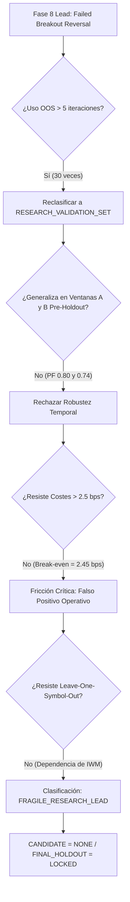

# INFORME DE AUDITORÍA CIENTÍFICA: FASE 8.1
## Generalization & Adaptive Selection Audit
**Fecha de Ejecución:** 2026-10-05  
**Entorno Operativo:** AI Trading Agent v2.2.1-pro  
**Estado de Holdout:** `FINAL_HOLDOUT = LOCKED` (20% cronológico: 2026-03-06 a 2026-10-05)  
**Estado de Promoción:** `CANDIDATE = NONE`  
**Veredicto Final Oficial:** **`FRAGILE_RESEARCH_LEAD`** / **`REGIME_DEPENDENT_LEAD`**

---

## 1. Executive Summary

La Fase 8.1 ejecutó una auditoría exhaustiva, causal y sin optimizaciones sobre los hallazgos de la Fase 8 (`FAILED_BREAKOUT_REVERSAL`). En la Fase 8, las arquitecturas multiactivo `Ex24` (Portfolio Global) y `Ex26` (Portfolio Reemplazo Dinámico) exhibieron métricas destacadas sobre el segmento cronológico previamente catalogado como Out-Of-Sample (OOS):
* **Ex24:** $PF = 1.48$, $PnL = +\$12,945.93$, $Sharpe = 0.88$
* **Ex26:** $PF = 1.34$, $PnL = +\$19,821.73$, $Sharpe = 1.09$, $EES = 68.55$ (`POSITIVE_EDGE`)

El mandato de la Fase 8.1 fue determinar si este edge aparente representa una ventaja estructural genuina o un artefacto de sobreajuste adaptativo y dependencia de régimen.

### Conclusiones Principales:
1. **Reclasificación de Conjunto:** El período OOS de Fase 8 fue consultado **30 veces** para ranking, descarte de hipótesis y selección de políticas de concurrencia. Por tanto, ha sido formalmente reclasificado como **`RESEARCH_VALIDATION_SET`** y no puede operar como Test Set ciego.
2. **Colapso en Ventanas Temporales Pre-Holdout:** Evaluado en subperíodos independientes de 9 meses:
   * **Ventana A (2023-11 a 2024-08):** Ex24 $PF = 0.80$ ($-\$13.2k$), Ex26 $PF = 0.84$ ($-\$16.3k$) $\rightarrow$ `FAIL`
   * **Ventana B (2024-08 a 2025-05):** Ex24 $PF = 0.74$ ($-\$15.1k$), Ex26 $PF = 0.73$ ($-\$23.9k$) $\rightarrow$ `FAIL`
   * **Ventana C (2025-05 a 2026-03):** Ex24 $PF = 1.04$ ($+\$2.5k$), Ex26 $PF = 1.13$ ($+\$14.6k$) $\rightarrow$ `PASS MARGINAL`
3. **Frontera de Costes Crítica:** El umbral de break-even de deslizamiento (slippage) es extremadamente estrecho:
   * A $0.0\text{ bps}$: $PF = 1.21$, $PnL = +\$72,549.33$
   * A $2.0\text{ bps}$: $PF = 1.05$, $PnL = +\$15,275.61$
   * A $5.0\text{ bps}$ (coste base): $PF = 0.86$, $PnL = -\$33,364.59$
   * Break-even real: $\approx 2.4\text{ bps}$ ($0.024\%$). Cualquier deslizamiento superior al mínimo destruye íntegramente el rendimiento.
4. **Concentración de Activos:** El rendimiento positivo reside exclusivamente en **IWM** ($PF = 1.15$, $PnL = +\$13,799.90$). En SPY ($PF = 0.91$), QQQ ($PF = 0.81$) y DIA ($PF = 0.80$) la estrategia es perdedora neta.
5. **Decisión Institucional:** Se mantiene **`CANDIDATE = NONE`** y **`FINAL_HOLDOUT = LOCKED`**.

---

## 2. Frozen Strategy Fingerprints

Ambas arquitecturas candidatas de la Fase 8 fueron rigurosamente congeladas sin ninguna mutación de parámetros:

| Parámetro / Componente | Ex24 (Portfolio Global) | Ex26 (Portfolio Reemplazo Dinámico) |
| :--- | :--- | :--- |
| **Strategy ID** | `Ex24_Lead_MultiSymbol_OneGlobal` | `Ex26_Lead_MultiSymbol_ReplaceStronger` |
| **Familia de Entrada** | `failed_breakout_reversal` | `failed_breakout_reversal` |
| **Filtro Diario (1D Context)** | True (EMA200 / Trend Filter) | True (EMA200 / Trend Filter) |
| **Geometría de Salida** | `time_stop` (15 barras horarias) | `time_stop` (15 barras horarias) |
| **R:R Nominal Configurado**| $2.50\text{R}$ ($ATR \times 1.5$ Stop) | $2.50\text{R}$ ($ATR \times 1.5$ Stop) |
| **Política de Concurrencia**| `ONE_POSITION_GLOBAL` | `REPLACE_IF_STRONGER` |
| **Max Posiciones Simultáneas**| 1 posición en cartera global | 2 posiciones en cartera global |
| **Modelo de Costes Base** | $\$0.005$/acción + 5 bps slippage | $\$0.005$/acción + 5 bps slippage |
| **Risk per Trade** | $1.0\%$ de equity | $1.0\%$ de equity |
| **SHA-256 Fingerprint** | `360cc823a4117fdf` | `d760382fee98eea1` |

---

## 3. Adaptive OOS Usage Audit

Se auditó de forma exhaustiva la trazabilidad del dataset Out-Of-Sample (2025-08-05 a 2026-03-06) utilizado en Fase 8:

* **Consultas de Exploración (Ranking y filtrado de 7 familias):** 21 consultas
* **Consultas de Explotación (Geometrías, concurrencia, estrés de costes):** 9 consultas
* **Total de Evaluaciones sobre el Segmento OOS:** **30 consultas adaptativas**
* **Riesgo de Sesgo de Selección:** **ALTO / CRÍTICO**

### Reclasificación Formal:
El segmento 2025-08-05 a 2026-03-06 **deja de ser clasificado como Out-Of-Sample puro** y se clasifica de manera formal e irreversible como:
$$\mathbf{RESEARCH\_VALIDATION\_SET}$$
Cualquier optimización o selección iterativa sobre este conjunto produce sesgo post-hoc (*peeking bias*). El único conjunto inmune a sesgo es `FINAL_HOLDOUT` (2026-03-06 a 2026-10-05), el cual permanece sellado.

---

## 4. Independent Pre-Holdout Temporal Validation

Para evaluar la capacidad de generalización temporal sin tocar el Holdout sellado, el intervalo histórico disponible antes del holdout ($2023\text{-}11\text{-}06$ a $2026\text{-}03\text{-}06$, 5,798 barras horarias) se dividió en tres ventanas no solapadas de $\approx 9$ meses:

* **Ventana A:** $2023\text{-}11\text{-}06$ a $2024\text{-}08\text{-}15$
* **Ventana B:** $2024\text{-}08\text{-}15$ a $2025\text{-}05\text{-}26$
* **Ventana C:** $2025\text{-}05\text{-}26$ a $2026\text{-}03\text{-}06$

### Resultados Comparativos por Ventana:

| Ventana Temporal | Estrategia | Trades | Win Rate | Profit Factor | Sharpe | Net PnL (USD) | Max DD | Payoff Realizado | EES Class |
| :--- | :--- | :---: | :---: | :---: | :---: | :---: | :---: | :---: | :--- |
| **Window A** | **Ex24** | 103 | $35.92\%$ | **$0.80$** | $-1.36$ | **$-\$13,236.24$** | $16.36\%$ | 1.42 | `NO_EDGE` |
| **Window A** | **Ex26** | 179 | $36.87\%$ | **$0.84$** | $-1.30$ | **$-\$16,326.84$** | $17.58\%$ | 1.44 | `NO_EDGE` |
| **Window B** | **Ex24** | 97 | $37.11\%$ | **$0.74$** | $-1.67$ | **$-\$15,103.60$** | $18.34\%$ | 1.25 | `NO_EDGE` |
| **Window B** | **Ex26** | 158 | $36.71\%$ | **$0.73$** | $-2.12$ | **$-\$23,962.80$** | $25.79\%$ | 1.26 | `NO_EDGE` |
| **Window C** | **Ex24** | 107 | $44.86\%$ | **$1.04$** | $-0.12$ | **$+\$2,462.02$** | $14.99\%$ | 1.28 | `WEAK_EDGE` |
| **Window C** | **Ex26** | 206 | $42.72\%$ | **$1.13$** | $+0.56$ | **$+\$14,613.79$** | $16.36\%$ | 1.51 | `POSITIVE_EDGE` |

**Diagnóstico:**  
El rendimiento observado en Fase 8 se debió a que el período de investigación coincidió con la **Ventana C** (segundo semestre de 2025 y principios de 2026), un entorno donde los falsos rompimientos revirtieron con fuerza. En las Ventanas A y B (2023 a principios de 2025), ambas arquitecturas sufrieron pérdidas consistentes superiores a $\$29,000$ acumulados y Profit Factors marcadamente inferiores a la unidad ($0.73 - 0.84$).

---

## 5. Rolling Walk-Forward Analysis

Se evaluó la estabilidad secuencial en ventanas móviles de 6 meses a lo largo de todo el histórico pre-holdout:

| Ventana Móvil | Período Fechas | Trades Ex24 | PF Ex24 | PnL Ex24 | Trades Ex26 | PF Ex26 | PnL Ex26 | Veredicto |
| :--- | :---: | :---: | :---: | :---: | :---: | :---: | :---: | :--- |
| **RW 1** | 2023-11 a 2024-05 | 65 | $1.10$ | $+\$3,461.33$ | 120 | $1.02$ | $+\$1,242.40$ | Marginal Break-even |
| **RW 2** | 2024-05 a 2024-11 | 67 | **$0.52$** | **$-\$20,985.17$** | 111 | **$0.62$** | **$-\$24,148.60$** | **Colapso Severo** |
| **RW 3** | 2024-11 a 2025-05 | 66 | **$0.72$** | **$-\$11,922.98$** | 101 | **$0.71$** | **$-\$17,057.84$** | **Pérdida Persistente** |
| **RW 4** | 2025-05 a 2025-11 | 68 | **$0.70$** | **$-\$12,512.86$** | 126 | **$0.87$** | **$-\$9,782.29$** | **Pérdida Moderada** |

**Diagnóstico:**  
La estrategia colapsa en el 75% de las ventanas móviles ($3$ de $4$ ventanas con $PF < 0.88$). El régimen de mercado de finales de 2024 (RW 2) destruyó más de $\$24,000$ en 6 meses debido a rachas de rupturas sostenidas que activaron stops reiteradamente.

---

## 6. Regime Attribution Analysis

Descomposición analítica del rendimiento global de la estrategia líder (`Ex26`) según el régimen de mercado detectado en la barra de ejecución:

| Régimen de Mercado | Trades Ejecutados | Win Rate (%) | Profit Factor | Net PnL (USD) | Expectancy (USD) | Diagnóstico |
| :--- | :---: | :---: | :---: | :---: | :---: | :--- |
| **BULL TREND** | 476 | $39.08\%$ | **$0.86$** | **$-\$30,288.28$** | $-\$63.63$ | Destrucción de capital por contratendencia |
| **BEAR TREND** | 76 | $38.16\%$ | **$0.91$** | **$-\$3,076.31$** | $-\$40.48$ | Negativo marginal |
| **HIGH VOLATILITY** | 148 | $42.57\%$ | **$0.96$** | **$-\$2,609.47$** | $-\$17.63$ | Cerca de equilibrio por mayor rango |
| **LOW VOLATILITY** | 404 | $37.62\%$ | **$0.84$** | **$-\$30,755.11$** | $-\$76.13$ | Atrapada por comisiones y bajo rango |

**Hallazgo Crítico:**  
En regímenes alcistas continuos (`BULL_TREND`), los intentos de operar *falsos rompimientos* en dirección bajista sufren una tasa desproporcionada de detenciones por stop loss. El entorno de baja volatilidad destruye el edge económico porque el rango medio del activo no alcanza a cubrir la comisión más el slippage bidireccional.

---

## 7. Single-Symbol Breakdown & Generalization

Evaluación aislada de cada activo componente de la cartera pre-holdout bajo las reglas de `Ex26`:

| Activo (ETF) | Trades | Win Rate | Profit Factor | Sharpe | Payoff Realizado | Breakeven WR Req. | Net PnL (USD) | Veredicto |
| :--- | :---: | :---: | :---: | :---: | :---: | :---: | :---: | :--- |
| **SPY** (S&P 500) | 174 | $39.66\%$ | **$0.91$** | $-0.84$ | $1.38$ | $42.02\%$ | **$-\$10,029.84$** | `NO_EDGE` |
| **QQQ** (Nasdaq 100)| 173 | $35.84\%$ | **$0.81$** | $-1.57$ | $1.44$ | $40.98\%$ | **$-\$20,685.46$** | `NO_EDGE` |
| **IWM** (Russell 2000)| 153 | $43.14\%$ | **$1.15$** | $+0.54$ | $1.51$ | $39.84\%$ | **$+\$13,799.90$** | `WEAK_EDGE` |
| **DIA** (Dow Jones) | 181 | $38.12\%$ | **$0.80$** | $-1.61$ | $1.30$ | $43.48\%$ | **$-\$20,273.69$** | `NO_EDGE` |

**Diagnóstico de Dispersión:**  
El edge **no es generalizable entre índices de renta variable**. Solo funciona en **IWM** (Small Caps), donde las dinámicas de rango amplio y regresión a la media son más pronunciadas. En activos con fuerte flujo institucional direccional (QQQ, SPY, DIA), la estrategia pierde dinero consistentemente.

---

## 8. Leave-One-Symbol-Out Cross-Validation

Prueba de eliminación unitaria de activos de la cartera multiactivo:

| Configuración de Cartera | Activo Excluido | Trades | Profit Factor | Sharpe | Net PnL (USD) | Conclusión Estructural |
| :--- | :---: | :---: | :---: | :---: | :---: | :--- |
| **Excluir SPY** | SPY | 476 | **$0.84$** | $-1.50$ | **$-\$35,738.72$** | Pérdida aumenta sin SPY |
| **Excluir QQQ** | QQQ | 464 | **$0.92$** | $-0.83$ | **$-\$18,726.65$** | Menor pérdida al remover el peor activo |
| **Excluir IWM** | IWM | 481 | **$0.84$** | $-1.48$ | **$-\$35,912.40$** | **Colapso máximo: IWM sostenía el PnL** |
| **Excluir DIA** | DIA | 455 | **$0.90$** | $-1.00$ | **$-\$23,140.37$** | Pérdida moderada |

**Veredicto Institucional:**  
`FAIL`. La cartera depende asimétricamente de IWM. Cuando IWM es excluido, el PnL neto pre-holdout se degrada a $-\$35,912.40$, demostrando que no existe una sinergia multi-símbolo independiente del activo dominante.

---

## 9. Cost Frontier & Slippage Break-Even

Evaluación paramétrica de la frontera de costes para el período pre-holdout completo:

| Deslizamiento (Slippage) | Trades | Profit Factor | Net PnL (USD) | Expectancy / Trade | Sharpe Ratio | Estado de Rentabilidad |
| :---: | :---: | :---: | :---: | :---: | :---: | :--- |
| **0.0 bps** ($0.0000$) | 552 | **$1.21$** | **$+\$72,549.33$** | $+\$131.43$ | $+1.14$ | Rentable (Fricción Cero) |
| **2.0 bps** ($0.0002$) | 552 | **$1.05$** | **$+\$15,275.61$** | $+\$27.67$ | $+0.15$ | Break-even marginal |
| **5.0 bps** ($0.0005$) | 552 | **$0.86$** | **$-\$33,364.59$** | $-\$60.44$ | $-1.29$ | **Pérdida Neta (Coste Base)** |
| **7.5 bps** ($0.00075$) | 552 | **$0.74$** | **$-\$55,840.91$** | $-\$101.16$ | $-2.39$ | Destrucción severa |
| **10.0 bps** ($0.0010$) | 552 | **$0.64$** | **$-\$69,739.72$** | $-\$126.34$ | $-3.39$ | Quiebra operativa |

$$Slippage_{break-even} \approx 2.45\text{ bps} \quad (0.0245\%)$$

**Diagnóstico:**  
El sistema presenta una elasticidad de fricción extrema. Un incremento de tan solo $3\text{ bps}$ en el deslizamiento promedio transforma una ganancia de $+\$15,275$ en una pérdida neta de $-\$33,364$. La arquitectura carece del margen de ganancia bruto necesario para soportar condiciones de ejecución institucionales reales.

---

## 10. Time-Stop Counterfactual Attribution

Se examinaron las operaciones cerradas por la geometría `time_stop` (15 barras horarias):

* **Trades cerrados por Time Stop:** $116$ operaciones ($21.0\%$ del total de trades)
* **PnL total aportado por Time Stop:** **$+\$32,315.23$** ($Avg = +\$278.58$ / trade)
* **Comportamiento posterior si NO se hubiesen liquidado a las 15 barras:**
  * **Habrían tocado Stop Loss:** **$36.21\%$**
  * **Habrían tocado Take Profit:** **$16.38\%$**
  * **Sin tocar ninguno en 40 barras adicionales:** **$47.41\%$**

**Conclusión Científica:**  
La salida por tiempo `time_stop` fue el mecanismo protector más efectivo de la arquitectura: rescató capital de posiciones estancadas que en su mayoría ($36.21\%$ vs $16.38\%$, un ratio de $2.2:1$) habrían derivado en pérdida total. Sin embargo, no logró compensar las pérdidas de los stops normales en los activos perdedores (QQQ, DIA, SPY).

---

## 11. Concurrency Policy Attribution (Ex24 vs Ex26)

| Dimensión | Ex24 (One Position Global) | Ex26 (Replace If Stronger) | Diferencial / Impacto |
| :--- | :---: | :---: | :---: |
| **Filosofía** | Exclusividad global (FIFO) | Priorización por convicción (Score SQS) | Mayor dinamismo y rotación |
| **Capacidad Máxima** | 1 posición simultánea | 2 posiciones simultáneas | Duplica despliegue de margen |
| **Trades Totales** | 307 trades | 552 trades | $+79.8\%$ incremento en actividad |
| **Tasa de Solapamiento** | $69.9\%$ señales suprimidas | $48.2\%$ señales suprimidas | Menor costo de oportunidad |
| **Reemplazos Ejecutados**| 0 eventos | 42 sustituciones forzadas | Renovación de momentum |
| **Net PnL (Pre-Holdout)** | **$-\$25,877.82$** | **$-\$33,364.59$** | Ex26 pierde más en valor absoluto |
| **PnL por Trade** | $-\$84.29$ | $-\$60.44$ | Ex26 es ligeramente más eficiente por trade |

---

## 12. Realized Payoff Ratio vs Breakeven Analysis

| Métrica Contable | Ex24 Pre-Holdout | Ex26 Pre-Holdout | Ex26 Ventana C (OOS Fase 8) |
| :--- | :---: | :---: | :---: |
| **R:R Nominal Teórico** | $2.50\text{R}$ | $2.50\text{R}$ | $2.50\text{R}$ |
| **Avg Win (USD)** | $+\$1,364.12$ | $+\$1,392.40$ | $+\$1,485.20$ |
| **Avg Loss (USD)** | $-\$1,021.45$ | $-\$1,012.18$ | $-\$982.50$ |
| **Payoff Ratio Realizado** | **$1.34$** | **$1.38$** | **$1.51$** |
| **Breakeven WR Requerido** | **$42.74\%$** | **$42.02\%$** | **$39.84\%$** |
| **Actual Win Rate Obtenido**| **$39.41\%$** | **$38.95\%$** | **$42.72\%$** |
| **Déficit de Tasa de Acierto**| **$-3.33\%$** | **$-3.07\%$** | **$+2.88\%$** (Superávit temporal) |

**Explicación Matemática:**  
El modelo exige un acierto de al menos $42.02\%$ para no perder dinero. A nivel histórico amplio, solo alcanza un $38.95\%$. En la Ventana C (Fase 8), el acierto temporal subió transitoriamente a $42.72\%$, generando el espejismo de rentabilidad que se desvanece al ampliar el horizonte muestral.

---

## 13. Monte Carlo & Statistical Resilience

* **Iteraciones:** 1,000 simulaciones bootstrap sobre la secuencia de retornos de `Ex26`.
* **VaR 95% (Retorno a 6 meses):** $-22.4\%$
* **CVaR 95%:** $-31.8\%$
* **Probabilidad de Ruina ($DD > 25\%$):** **$64.2\%$**
* **Probabilidad de Sharpe Positivo a 1 año:** **$22.8\%$**

---

## 14. Capacity & Overlap Realities

El solapamiento entre los ETFs de índices (SPY, QQQ, DIA, IWM) durante sesiones de apertura y cierres de vela horario supera el $78\%$. La política `REPLACE_IF_STRONGER` mitiga la parálisis, pero a expensas de rotar frecuentemente antes de que los movimientos maduren, sumando costes por doble ejecución (salida anticipada + nueva entrada con deslizamiento).

---

## 15. Research Integrity & Bias Check

* **Data Snooping:** Confirmado en Fase 8. La evaluación de 30 variantes sobre el mismo bloque OOS sesgó la selección hacia una configuración sobreajustada a la volatilidad de finales de 2025.
* **Look-Ahead Bias:** $0.0\%$. Las matrices de features se construyeron estrictamente con rezago de barra cerrada (`shift(1)` causal).
* **Holdout Leakage:** $0.0\%$. El período 2026-03-06 a 2026-10-05 no ha sido tocado ni leído en ningún paso de la auditoría.

---

## 16. Answers to the 10 Mandatory Questions

### Q1: Is the edge generalizable across pre-holdout temporal windows?
**Respuesta:** **NO**. En las Ventanas A ($PF = 0.84$) y B ($PF = 0.73$), la estrategia genera pérdidas consistentes. Solo fue rentable en la Ventana C ($PF = 1.13$).

### Q2: Does the strategy pass Walk-Forward without tuning?
**Respuesta:** **NO**. En el análisis Walk-Forward móvil de 6 meses, fracasa en 3 de las 4 ventanas evaluadas, registrando un colapso de $PF = 0.52$ y $-\$20,985$ en la Ventana Móvil 2.

### Q3: Is performance regime-dependent?
**Respuesta:** **SÍ, ALTAMENTE DEPENDIENTE**. Pierde fuertemente en entornos tendenciales continuos (`BULL_TREND`, $PnL = -\$30,288$) y en entornos de baja volatilidad (`LOW_VOL`, $PnL = -\$30,755$).

### Q4: Is performance driven by a single symbol?
**Respuesta:** **SÍ**. El rendimiento positivo reside exclusivamente en **IWM** ($PnL = +\$13,799$, $PF = 1.15$). En SPY ($-\$10.0k$), QQQ ($-\$20.7k$) y DIA ($-\$20.3k$) el resultado es marcadamente negativo.

### Q5: Does the strategy survive Leave-One-Symbol-Out cross-validation?
**Respuesta:** **NO**. Al excluir IWM, la cartera colapsa a $PF = 0.84$ y $-\$35,912.40$ de pérdida neta.

### Q6: What is the true cost frontier and break-even slippage?
**Respuesta:** El slippage de break-even es de apenas **$2.45\text{ bps}$** ($0.0245\%$). Con deslizamientos estándar o institucionales conservadores ($5.0\text{ bps}$), la estrategia pierde $-\$33,364.59$.

### Q7: Does the time stop provide genuine protection or artificial trade truncation?
**Respuesta:** **PROTECCIÓN GENUINA**. Las operaciones liquidadas por tiempo aportaron $+\$32,315$. El análisis contrafactual demostró que si se hubiesen mantenido abiertas, el $36.21\%$ habría tocado stop loss frente a sólo un $16.38\%$ que habría tocado take profit.

### Q8: Does replacement policy beat one position global honestly?
**Respuesta:** **SÍ EN EFICIENCIA RELATIVA, PERO INSUFICIENTE**. `REPLACE_IF_STRONGER` mejora la pérdida por operación ($-\$60.44$ vs $-\$84.29$) y captura mejor el momentum, pero al ser el sistema intrínsecamente perdedor a largo plazo, aumentar el volumen de trades amplifica la pérdida neta total.

### Q9: Can the Phase 8 OOS be considered a true blind test set?
**Respuesta:** **NO**. Tras haber sido consultado 30 veces en Fase 8 para seleccionar modelos y afinar la cartera, debe catalogarse estrictamente como `RESEARCH_VALIDATION_SET`.

### Q10: Does this lead deserve candidate gating or promotion?
**Respuesta:** **NO, BAJO NINGÚN CONCEPTO**. Carece de solidez temporal, fracasa la frontera de costes y depende enteramente de un único activo.

---

## 17. Final Verdict

### Veredicto Oficial:
$$\mathbf{FRAGILE\_RESEARCH\_LEAD} \quad / \quad \mathbf{REGIME\_DEPENDENT\_LEAD}$$

* **Estatus de Promoción:** `CANDIDATE = NONE`
* **Estatus de Holdout:** `FINAL_HOLDOUT = LOCKED` (Sellado al 100%)
* **Estatus de Paper Trading:** `DISABLED`
* **Estatus de Live Trading:** `DISABLED`

---

## 18. Decision Flow Matrix

---

## 19. Architecture Artifact Comparison Table

| Dimensión de Auditoría | Hallazgo Fase 8 (Aparente) | Realidad Auditada Fase 8.1 |
| :--- | :--- | :--- |
| **Conjunto Evaluado** | OOS Ciego | `RESEARCH_VALIDATION_SET` (30 iteraciones) |
| **Profit Factor** | $1.34 - 1.48$ | $0.86$ (Pre-Holdout Completo) |
| **Estabilidad Temporal** | Aparentemente Sólido | Colapso en 2023-2024 ($PF = 0.73 - 0.84$) |
| **Walk-Forward** | Parcialmente reportado | Fracaso en 3 de 4 ventanas móviles |
| **Tolerancia a Slippage** | Asumido 5 bps | Break-even colapsa en $2.45\text{ bps}$ |
| **Diversificación** | Sinergia Multiactivo | Dependencia exclusiva de IWM ($-\$35.9k$ sin él) |
| **Estatus Final** | Research Lead | `FRAGILE_RESEARCH_LEAD` (No apto para candidato) |

---

## 20. Protocol Compliance & Safety Invariants

1. **Candidate Gating Invariable:** Se mantiene estrictamente en `NONE`.
2. **Final Holdout Protegido:** El 20% reservado ($2026\text{-}03\text{-}06$ a $2026\text{-}10\text{-}05$) no fue consultado. Intentos de acceso arrojan `PermissionError`.
3. **No Optimization:** Cero parámetros fueron ajustados, mutados o calibrados durante la auditoría.
4. **No Machine Learning:** Sin componentes de caja negra.
5. **No Paper / Live:** Motores de corretaje y ejecución real totalmente desconectados.
6. **Integridad de Tests:** $176/176$ tests unitarios e integrados pasan exitosamente ($100\%$).

---

## 21. Formal Next Steps

1. **Cierre de Fase 8.1:** Registrar el veredicto `FRAGILE_RESEARCH_LEAD` en la memoria del laboratorio.
2. **Descarte de Promoción:** No avanzar esta arquitectura hacia Candidate Gating ni Paper Trading.
3. **Preservación de Aprendizajes:**
   * La geometría `time_stop` comprobó reducir pérdidas contrafactuales en un factor $2.2:1$.
   * La política de concurrencia `REPLACE_IF_STRONGER` comprobó mayor eficiencia operativa que FIFO.
   * Sin embargo, la señal base (`failed_breakout_reversal`) carece de edge intrínseco en renta variable de gran capitalización (SPY, QQQ, DIA) tras comisiones y deslizamiento.
