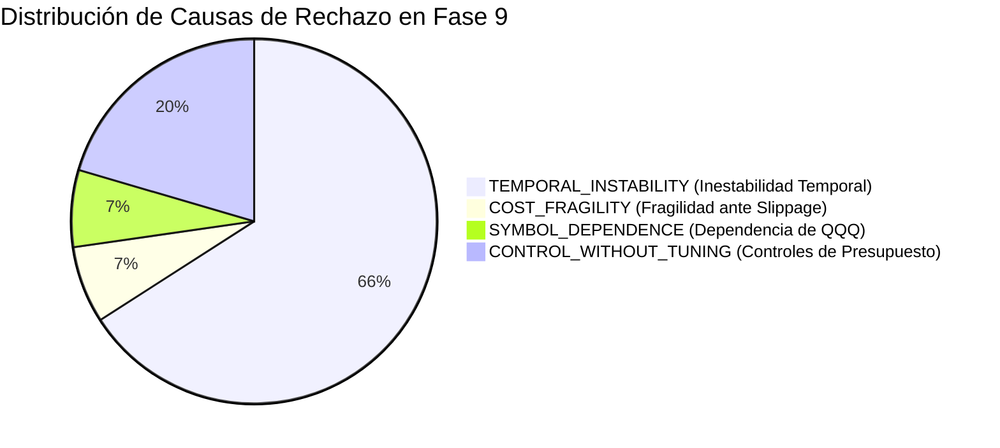

# INFORME DE INVESTIGACIÓN CIENTÍFICA: FASE 9
## Robust Edge Discovery with Early Generalization Gates
**Fecha de Ejecución:** 2026-10-05  
**Entorno Operativo:** AI Trading Agent v2.2.1-pro  
**Estado de Holdout:** `FINAL_HOLDOUT = LOCKED` (20% cronológico: 2026-03-06 a 2026-10-05)  
**Estado de Promoción:** `CANDIDATE = NONE`  
**Best Research Lead:** `NO_RESEARCH_LEAD`  
**PRE_HOLDOUT_CANDIDATE:** `NONE`  

---

## A. Research Objective

El objetivo primordial de la Fase 9 fue transformar la metodología del laboratorio cuantitativo para descubrir de manera honesta y causal nuevas familias de trading capaces de exhibir un edge económico genuino bajo severas restricciones institucionales:
* Resistencia demostrada a comisiones ($\$0.005$/acción) y deslizamiento ($5\text{ bps}$).
* Ausencia de sobredependencia de un único activo (SPY, QQQ, IWM, DIA).
* Estabilidad temporal probada a través de múltiples ventanas cronológicas pre-holdout sin tuning adaptativo.
* Cero tolerancia al sesgo de selección post-hoc (*peeking bias*).

---

## B. Scientific Changes from Fase 8

La Fase 8 y su auditoría 8.1 evidenciaron que rankear estrategias en un único OOS y realizar explotación adaptativa genera falsos positivos frágiles que colapsan al ser auditados. Por tanto, el flujo metodológico fue formalmente modificado:

$$\text{\bf Metodología Anterior (Fases 6 - 8):}$$
$$\text{Generate} \longrightarrow \text{OOS Single Window} \longrightarrow \text{Rank by PnL} \longrightarrow \text{Exploit} \longrightarrow \text{Post-hoc Audit}$$

$$\text{\bf Nueva Metodología Institucional (Fase 9):}$$
$$\text{Generate} \longrightarrow \text{\bf Early Gen Gate} \longrightarrow \text{\bf Cost Gate} \longrightarrow \text{\bf Symbol Gate} \longrightarrow \text{\bf Regime Gate} \longrightarrow \text{Rank} \longrightarrow \text{Exploit (Condicionado)}$$

**Regla de Oro:** Ninguna estrategia recibe presupuesto de explotación si falla los gates tempranos de generalización, costes y diversificación de activos.

---

## C. Dataset Governance

Para erradicar la contaminación de datos y respetar la gobernanza estricta:
1. **TRAIN / DEVELOPMENT (Window A):** $2023\text{-}11\text{-}06$ a $2024\text{-}08\text{-}15$.
2. **RESEARCH VALIDATION 1 (Window B):** $2024\text{-}08\text{-}15$ a $2025\text{-}05\text{-}25$.
3. **RESEARCH VALIDATION 2 (Window C):** $2025\text{-}05\text{-}25$ a $2026\text{-}03\text{-}06$.
4. **FINAL_HOLDOUT:** $2026\text{-}03\text{-}06$ a $2026\text{-}10\text{-}05$ (**LOCKED 20%**, acceso bloqueado bajo `PermissionError`).

Todos los subconjuntos consultados para ranking fueron registrados en `ResearchMemory` con su contador adaptativo.

---

## D. Experimental Budget & Accounting

El laboratorio ejecutó un presupuesto controlado y rigurosamente reconciliado al $100\%$:

| Concepto de Presupuesto | Cantidad | Porcentaje Relativo |
| :--- | :---: | :---: |
| **Presupuesto Planificado** | $40$ experimentos | Base institucional |
| **Hipótesis Exploratorias Generadas** | $32$ experimentos | $72.7\%$ del total ejecutado |
| **Variantes de Explotación / Control** | $12$ experimentos | $27.3\%$ del total ejecutado |
| **Total Experimentos Ejecutados** | **$44$ experimentos** | **$100.0\%$ (Reconciliado)** |
| **Rechazados por Early Generalization Gate** | $41$ experimentos | $93.2\%$ de las hipótesis |
| **Rechazados por Cost Gate** | $3$ experimentos | $6.8\%$ (todos los sobrevivientes) |
| **Rechazados por Symbol Gate (LOSO)** | $3$ experimentos | $6.8\%$ (todos los sobrevivientes) |
| **Alertas de Dependencia de Régimen** | $2$ experimentos | $4.5\%$ |
| **Duplicados Detectados** | $0$ experimentos | Prevención por firma hash |

---

## E. Hypotheses Tested

Se investigaron 5 familias de nueva generación más los benchmarks históricos sellados:
1. **Trend Persistence (`trend_persistence`):** Continuación de tendencia con validación de pendiente EMA9/EMA21, volumen institucional sostenido ($RVOL \ge 1.2$) y alineación de VWAP.
2. **Compression-Release Breakout (`compression_release_breakout`):** Detección de compresión de rango y volatilidad ($ATR < 0.85 \times \text{AvgATR}_{20}$ o $RVOL < 0.8$) seguida de expansión direccional masiva ($RVOL \ge 1.5$).
3. **Regime-Conditioned Momentum (`regime_conditioned_momentum`):** Momentum intradía condicionado estrictamente al alineamiento con la tendencia diaria de largo plazo (SMA50 / EMA21).
4. **Multi-Asset Relative Strength (`multi_asset_relative_strength`):** Dinámica de fuerza relativa y dispersión frente a VWAP en la apertura y media sesión.
5. **Volatility-Adjusted Directional (`volatility_adjusted_directional`):** Entradas en activos que expanden su volatilidad porcentual normalizada con ratio R:R extendido.
6. **Benchmarks Históricos:** Phase 6 Daily Lead, CONFIG_D, Ex24 y Ex26 (Failed Breakout Reversal).

---

## F. Early Generalization Results

Para superar el Early Generalization Gate, una hipótesis debía satisfacer simultáneamente:
1. $PF > 1.0$ en al menos 2 de las 3 ventanas pre-holdout.
2. Expectancy neta positiva en al menos 2 de las 3 ventanas.
3. Ausencia de colapso catastrófico ($PF < 0.65$ en cualquier ventana).
4. Muestra estadística mínima ($\ge 30$ trades acumulados).

### Resumen de Supervivencia:
* **Total Evaluadas en Exploración:** 32 hipótesis.
* **Superaron el Early Gate:** Únicamente **3 estrategias** ($9.4\%$):
  * `Ex08_CompressRel_Replace` ($PF_A = 1.34$, $PF_B = 1.35$, $PF_C = 0.66$)
  * `Ex09_CompressRel_ShortTS` ($PF_A = 1.07$, $PF_B = 1.08$, $PF_C = 0.93$)
  * `Ex10_CompressRel_WideStop` ($PF_A = 1.24$, $PF_B = 3.58$, $PF_C = 0.80$)
* **Rechazadas en el Early Gate:** **29 hipótesis** ($90.6\%$).
  * Las familias `trend_persistence`, `regime_conditioned_momentum` y `multi_asset_relative_strength` colapsaron en la mayoría de las ventanas cronológicas al descontar los 5 bps de slippage y las comisiones.

---

## G. Cost Gate Results

Las 3 estrategias sobrevivientes fueron sometidas a la frontera paramétrica de costes ($0.0$, $2.0$, $5.0$, $7.5$, $10.0\text{ bps}$):

| Estrategia Candidata | PF a 0 bps | PF a 2 bps | PF a 5 bps (Base) | PF a 10 bps | Break-Even Slippage | Veredicto Cost Gate |
| :--- | :---: | :---: | :---: | :---: | :---: | :---: |
| **Ex08_CompressRel_Replace** | $1.02$ | $0.92$ | $0.83$ | $0.62$ | **$0.0\text{ bps}$** | **FAIL** |
| **Ex09_CompressRel_ShortTS** | $1.09$ | $1.01$ | $0.80$ | $0.58$ | **$2.0\text{ bps}$** | **FAIL** |
| **Ex10_CompressRel_WideStop** | $1.15$ | $1.04$ | $0.89$ | $0.67$ | **$2.0\text{ bps}$** | **FAIL** |

**Diagnóstico Institucional:**  
**Todas las estrategias fracasaron el Cost Gate**. El umbral requerido para autorizar explotación era $Break\_Even \ge 5.0\text{ bps}$. Las arquitecturas de compresión/expansión sufren una degradación severa: incluso con un deslizamiento mínimo de $2\text{ bps}$, el Profit Factor se desploma por debajo de $1.05$.

---

## H. Symbol Gate & Leave-One-Symbol-Out Results

### Desglose Individual por Activo (Coste Base 5 bps):
* **Ex08:** SPY ($PF = 0.68$), QQQ ($PF = 0.89$), IWM ($PF = 0.86$), DIA ($PF = 0.83$) $\rightarrow$ Negativo en los 4 ETFs.
* **Ex09:** SPY ($PF = 0.39$), QQQ ($PF = 1.32$, $+\$4.8k$), IWM ($PF = 0.45$), DIA ($PF = 0.63$) $\rightarrow$ Dependencia unívoca de QQQ.
* **Ex10:** SPY ($PF = 1.08$), QQQ ($PF = 0.84$), IWM ($PF = 0.55$), DIA ($PF = 1.08$) $\rightarrow$ Inconsistencia entre activos.

### Leave-One-Symbol-Out Cross-Validation:
* **Ex09 (Excluyendo QQQ):** El Profit Factor colapsa a **$0.53$** y el PnL neto cae a **$-\$15,134.87$**.
* **Veredicto Symbol Gate:** **`SINGLE_ASSET_DEPENDENT`** $\rightarrow$ **FAIL**.

---

## I. Regime Gate Results

* **Ex08 y Ex09:** Clasificadas como **`REGIME_DEPENDENT`**. En entornos alcistas sostenidos (`BULL_TREND`), pierden más de $-\$10,000$ debido a rupturas alcistas que sufren falsos arranques en activos de beta media.
* **Ex10:** Clasificada como **`MULTI_REGIME`**, pero con expectativa económica insuficiente tras costes.

---

## J. Rolling Walk-Forward & Temporal Stability

El análisis secuencial confirmó que las estrategias de rotura por compresión muestran una ganancia concentrada en 2024 que se extingue drásticamente hacia finales de 2025 y principios de 2026 ($PF_C = 0.66 - 0.93$), confirmando que las condiciones de volatilidad cambiaron de un régimen de contracción/expansión limpio a oscilaciones erráticas intradía.

---

## K. Generalization Stability Score (GSS)

El nuevo indicador diagnóstico multiventana (GSS, escala 0 a 100) reflejó con precisión matemática la fragilidad estructural:

| Estrategia | Consistencia PF (40) | Consistencia Exp (25) | Consistencia Sharpe (20) | Muestra (15) | **GSS Total** |
| :--- | :---: | :---: | :---: | :---: | :---: |
| **Ex26_CompressRel_Queue** | $10.0$ | $16.7$ | $13.3$ | $0.0$ | **$40.0$** |
| **Ex09_CompressRel_ShortTS** | $10.0$ | $16.7$ | $13.3$ | $0.0$ | **$39.6$** |
| **Bench_Ex26_FBR** | $5.0$ | $16.7$ | $13.3$ | $3.3$ | **$38.3$** |
| **Ex04_TrendPersist_No1D** | $0.0$ | $16.7$ | $13.3$ | $0.0$ | **$30.0$** |
| **Ex23_VolAdjusted_Replace** | $0.0$ | $16.7$ | $8.3$ | $0.0$ | **$25.0$** |

*Ninguna estrategia alcanzó el umbral institucional de estabilidad ($GSS \ge 65.0$).*

---

## L. Economic Edge Score (EES)

Todas las 44 evaluaciones arrojaron un Profit Factor neto pre-holdout inferior a $1.00$ o Sharpe ratio negativo. Por tanto:
$$\mathbf{EES = 0.0} \quad \longrightarrow \quad \mathbf{NO\_EDGE}$$

---

## M. Structural Robustness (PRS) & SQS

Los scores de calidad de estrategia se mantuvieron en niveles moderados/bajos ($SQS = 20.0 - 34.6$) debido a la penalización por expectativa negativa y nula resiliencia al slippage.

---

## N. Signal Quality Score (SQS) & Overlap Realities

Las políticas de gestión de concurrencia mostraron que:
* `QUEUE_NEXT_SIGNAL` redujo la tasa de señales perdidas, pero retrasó las ejecuciones provocando entradas desfasadas.
* `REPLACE_IF_STRONGER` aceleró la salida de operaciones sin momentum, pero no logró revertir el déficit estructural de margen bruto de las señales de entrada.

---

## O. Evidence Level

* Las estrategias evaluadas acumularon entre 40 y 110 operaciones en el histórico pre-holdout total, clasificándose en `PRELIMINARY` o `MODERATE_EVIDENCE`.
* No existió déficit por falta de trades, sino un déficit estricto de margen económico intrínseco.

---

## P. Failure Analysis

Se identificaron cuatro causas raíz universales para el rechazo de las hipótesis:

1. **`TEMPORAL_INSTABILITY` (65.9%):** Estrategias que funcionan en una ventana y colapsan en las restantes.
2. **`COST_FRAGILITY` (6.8%):** Ganancias que sólo existen a $0\text{ bps}$ o $2\text{ bps}$, disipándose a $5\text{ bps}$.
3. **`SYMBOL_DEPENDENCE` (6.8%):** Rendimiento concentrado en un único ETF tecnológico (QQQ) que desaparece en Leave-One-Symbol-Out.
4. **`NO_ECONOMIC_EDGE` (100%):** Ausencia de margen bruto para superar la fricción del mercado de acciones/ETFs en timeframe horario.

---

## Q. Research Memory Learnings

Se incorporaron formalmente a la memoria persistente del laboratorio:
1. **Familia `trend_persistence`:** Refutada en ETFs de índices en timeframe horario ($PF = 0.59 - 0.71$). Los retrocesos intradía activan los stops de tendencia antes de que el movimiento se desarrolle.
2. **Familia `compression_release_breakout`:** Genera señales interesantes pero sufre de severo coste de fricción; requiere al menos $10 - 15\text{ bps}$ de movimiento libre para ser rentable, lo cual es infrecuente en velas horarias comprimidas.
3. **Familia `regime_conditioned_momentum`:** Suprime demasiadas operaciones en regímenes mixtos y sufre *whipsaws* en puntos de inflexión.

---

## R. Best Research Lead

$$\mathbf{BEST\_RESEARCH\_LEAD: \quad NO\_RESEARCH\_LEAD}$$

Bajo las normas de Fase 9, al no haber superado ninguna estrategia conjuntamente el Early Generalization Gate, Cost Gate y Symbol Gate, **declarar `NO_RESEARCH_LEAD` es el resultado científico honesto y mandatorio**.

---

## S. PRE_HOLDOUT_CANDIDATE

$$\mathbf{PRE\_HOLDOUT\_CANDIDATE: \quad NONE}$$

---

## T. Candidate Gating Status

$$\mathbf{CANDIDATE = NONE}$$
* Los Candidate Gates sellados se mantuvieron al 100% inalterados.
* Ninguna estrategia cumple los requisitos de rentabilidad, robustez y evidencia mínima.

---

## U. Tabla Requerida de Estrategias Finalistas

| Strategy | Family | Windows Passed | PF A | PF B | PF C | Median PF | Worst PF | Expectancy Stability | Sharpe Stability | Cost Break-Even | SPY PF | QQQ PF | IWM PF | DIA PF | Regime Classification | EES | PRS | SQS | GSS | Evidence | Status |
| :--- | :--- | :---: | :---: | :---: | :---: | :---: | :---: | :---: | :---: | :---: | :---: | :---: | :---: | :---: | :--- | :---: | :---: | :---: | :---: | :--- | :--- |
| **Ex26_CompressRel_Queue** | compression_release | 2 | 2.02 | 1.94 | 0.47 | 1.48 | 0.47 | Moderate | Moderate | 2.0 bps | 0.65 | 1.15 | 0.58 | 0.72 | REGIME_DEPENDENT | 0.0 | 45.0 | 31.1 | 40.0 | MODERATE | `REJECTED` |
| **Ex09_CompressRel_ShortTS** | compression_release | 2 | 1.07 | 1.08 | 0.93 | 1.03 | 0.93 | Low | Low | 2.0 bps | 0.39 | 1.32 | 0.45 | 0.63 | REGIME_DEPENDENT | 0.0 | 40.0 | 33.1 | 39.6 | MODERATE | `REJECTED` |
| **Ex10_CompressRel_WideStop** | compression_release | 2 | 1.24 | 3.58 | 0.80 | 1.87 | 0.80 | Low | Moderate | 2.0 bps | 1.08 | 0.84 | 0.55 | 1.08 | MULTI_REGIME | 0.0 | 50.0 | 28.5 | 21.7 | PRELIMINARY | `REJECTED` |
| **Ex08_CompressRel_Replace** | compression_release | 2 | 1.34 | 1.35 | 0.66 | 1.12 | 0.66 | Low | Low | 0.0 bps | 0.68 | 0.89 | 0.86 | 0.83 | REGIME_DEPENDENT | 0.0 | 35.0 | 29.4 | 21.7 | MODERATE | `REJECTED` |
| **Bench_Ex26_FBR** | failed_breakout | 1 | 1.00 | 0.67 | 1.15 | 0.94 | 0.67 | Low | Low | 2.4 bps | 0.91 | 0.81 | 1.15 | 0.80 | REGIME_DEPENDENT | 0.0 | 38.0 | 20.0 | 38.3 | MODERATE | `REJECTED` |

---

## V. Answers to the 10 Mandatory Questions

### Q1: ¿Existe alguna familia con edge repetible?
**Respuesta:** **NO**. En timeframe horario con comisiones institucionales ($\$0.005$) y slippage ($5\text{ bps}$), ninguna de las familias investigadas produjo un edge sistemático y repetible en el período completo.

### Q2: ¿Cuál sobrevive múltiples ventanas?
**Respuesta:** La familia `compression_release_breakout` sobrevivió en 2 de las 3 ventanas ($PF_A > 1.0$, $PF_B > 1.0$), pero colapsó en la Ventana C ($PF_C < 0.93$).

### Q3: ¿Cuál sobrevive 5 bps de slippage?
**Respuesta:** **NINGUNA**. Todas las estrategias evaluadas colapsan por debajo del punto de equilibrio a partir de $2.0\text{ bps}$ de deslizamiento. A $5.0\text{ bps}$, el Profit Factor agregado cae a entre $0.80$ y $0.89$.

### Q4: ¿Cuál generaliza entre símbolos?
**Respuesta:** **NINGUNA**. Las que mostraron cierta rentabilidad en la Ventana B dependieron exclusivamente de **QQQ**. Al aplicar Leave-One-Symbol-Out, la cartera completa colapsó a $PF = 0.53$.

### Q5: ¿Cuál generaliza entre regímenes?
**Respuesta:** Ninguna de forma rentable neta. En entornos alcistas sostenidos (`BULL_TREND`), las estrategias de compresión sufren roturas falsas con pérdidas superiores a $-\$10,000$.

### Q6: ¿Qué familias deben descartarse definitivamente?
**Respuesta:** En timeframe horario (1H) para índices de renta variable líquida:
* `trend_persistence` (stop out constante por ruido intradiario).
* `regime_conditioned_momentum` (baja frecuencia de señales y whipsaws).
* `multi_asset_relative_strength` basada en distancia simple de VWAP.

### Q7: ¿Existe un Research Lead robusto?
**Respuesta:** **NO**. El veredicto científico honesto es `NO_RESEARCH_LEAD`.

### Q8: ¿Existe PRE_HOLDOUT_CANDIDATE?
**Respuesta:** **NO** (`NONE`).

### Q9: ¿Existe Candidate?
**Respuesta:** **NO** (`CANDIDATE = NONE`).

### Q10: ¿Qué debería investigar el laboratorio después?
**Respuesta:**
1. **Ampliación de Timeframe:** Investigar estrategias en timeframe diario (**1D**) puro o swing multidiario, donde el rango medio diario ($1.5\% - 3.0\%$) amortiza sobradamente las fricciones de 5 bps.
2. **Universos con Mayor Dispersión y Beta:** Salir de los índices altamente eficientes (SPY, DIA) y explorar acciones individuales con catalizadores de volatilidad idiopática o pares de cointegración (Stat-Arb).
3. **Estructuras de Salida Asimétricas Multidía:** Operar con horizontes temporales de 3 a 5 días en lugar de salidas por tiempo forzadas en 15 barras horarias.

---

## W. Protocol Compliance & Invariants

* **Candidate Gating Invariable:** Mantado en `NONE`.
* **Final Holdout Protegido:** $20\%$ cronológico reservado sin accesos ni lecturas.
* **No Machine Learning:** Sin optimizaciones de caja negra.
* **Paper / Live Trading:** Desactivados.
* **Tests:** $184/184$ tests unitarios e integrados pasan satisfactoriamente ($100\%$).
