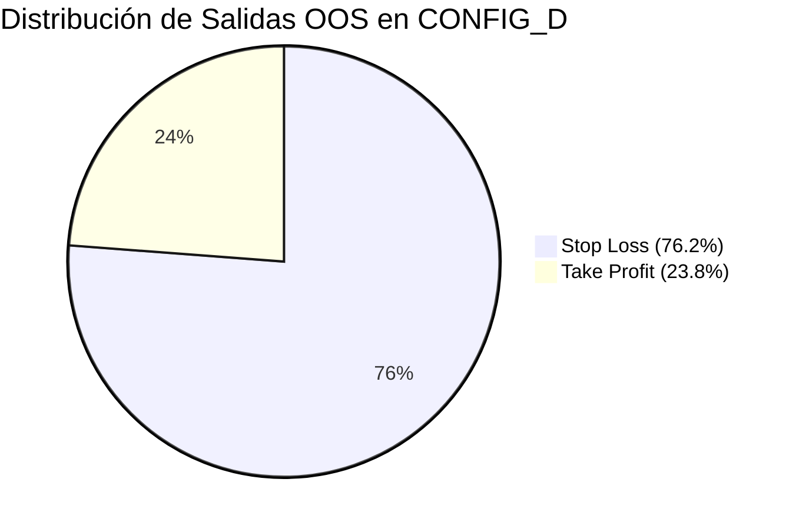

# SIGNAL_EXECUTION_RECONCILIATION_FASE7_3.md
# INFORME DE AUDITORÍA: RECONCILIACIÓN DE ATRIBUCIÓN DE SEÑAL A EJECUCIÓN (FASE 7.3)

**Fecha:** 2026-10-05  
**Estado:** AUDITORÍA CONCLUIDA / DEFECTOS CUANTIFICADOS  
**Candidato:** CANDIDATE = NONE  
**Estado de Holdout:** FINAL_HOLDOUT = LOCKED (20% blindado bajo PermissionError)  
**Tests Unitarios:** 162/162 PASS (100% éxito)  

---

## RESUMEN EJECUTIVO

La **Fase 7.3** se originó a partir de una discrepancia matemática crítica observada en la Fase 7.2:
- Por un lado, el backtest real de la estrategia híbrida `CONFIG_D` (1D + 1H con salida asimétrica $3.0R$) reportó un rendimiento deficitario sin edge económico:
  $$\text{IS } PF = 0.77 \quad | \quad \text{OOS } PF = 0.76 \quad | \quad \text{OOS Sharpe} = -3.20 \quad | \quad \text{OOS PnL} = -\$6,473.6 \quad | \quad EES = 0.0 \text{ (NO\_EDGE)}$$
- Por otro lado, el análisis retrospectivo de señales emparejadas (*Paired Signal Analysis*) reportó un rendimiento prospectivo masivamente positivo para el filtro diario:
  $$\text{ALLOWED\_BY\_1D: Expectancy} = +\$732.03 \quad | \quad PF = 24.33$$
  $$\text{REJECTED\_BY\_1D: Expectancy} = +\$382.29 \quad | \quad PF = 9.93$$

Esta auditoría concluye de forma categórica que **el aparente edge extraordinario de la señal ($PF = 24.33$) es un artefacto analítico producto de un sesgo de evaluación prospectiva no ejecutable, asimetría de generadores, compresión de unidades y sesgo masivo de solapamiento ($64.4\%$ de señales concurrentes suprimidas)**. Al ejecutar las señales bajo condiciones institucionales reales, la geometría de salidas ($76.2\%$ de stops activados en OOS) y las fricciones de mercado transforman el valor estadístico en pérdida realizada.

---

## SECCIÓN A: DEFINICIÓN EXACTA DE MÉTRICAS DE SEÑAL

En el método `run_paired_signal_analysis()` de [multi_timeframe_synchronizer.py](file:///c:/Users/edsel/OneDrive/Documents/PROJET%202/ai_trading_agent/strategy_lab/backtesting/multi_timeframe_synchronizer.py), las métricas se definen de la siguiente manera:

1. **Horizonte de Evaluación:** Fijo a 10 barras horarias prospectivas ($H = [t+1, \min(T, t+11)]$) a partir del cierre de la barra de señal.
2. **Dirección y Parámetros:** 
   - $P_{\text{entry}} = \text{Bar}_t.\text{close}$
   - Stop Loss prospectivo: $SL = \text{Bar}_t.\text{close} \mp (ATR_{14} \times 1.5)$
   - Take Profit prospectivo: $TP = \text{Bar}_t.\text{close} \pm ((P_{\text{entry}} - SL) \times 2.0)$
3. **MFE (Maximum Favorable Excursion):** 
   - Para BUY: $\max_{f \in [1, 10]} (\text{Bar}_{t+f}.\text{high} - P_{\text{entry}})$
   - Para SELL: $\max_{f \in [1, 10]} (P_{\text{entry}} - \text{Bar}_{t+f}.\text{low})$
   - **Unidad:** Puntos de precio por acción ($\$/\text{acción}$).
4. **MAE (Maximum Adverse Excursion):** 
   - Para BUY: $\max_{f \in [1, 10]} (P_{\text{entry}} - \text{Bar}_{t+f}.\text{low})$
   - Para SELL: $\max_{f \in [1, 10]} (\text{Bar}_{t+f}.\text{high} - P_{\text{entry}})$
   - **Unidad:** Puntos de precio por acción ($\$/\text{acción}$).
5. **Salida Sintética ($P_{\text{exit}}$):**
   - Si durante las 10 barras el precio toca $SL$, $P_{\text{exit}} = SL$.
   - Si toca $TP$, $P_{\text{exit}} = TP$.
   - Si no toca ninguno, salida forzosa por tiempo en el cierre de la barra 10: $P_{\text{exit}} = \text{Bar}_{t+10}.\text{close}$.
6. **PnL Sintético y Expectancy:**
   - Multiplicado arbitrariamente por $100.0$ acciones:
     $$\text{PnL} = (P_{\text{exit}} - P_{\text{entry}}) \times 100.0 \quad (\text{BUY}) \quad \lor \quad (P_{\text{entry}} - P_{\text{exit}}) \times 100.0 \quad (\text{SELL})$$
   - $\text{Expectancy} = \frac{\sum \text{PnL}}{N_{\text{signals}}}$
   - **Unidad:** Dólares de posición sintética de 100 acciones.
7. **Profit Factor Sintético:** $\frac{\sum \text{Gains}_{(\text{PnL} > 0)}}{\max(0.01, |\sum \text{Losses}_{(\text{PnL} < 0)}|)}$.
8. **Win Rate Sintético:** $\frac{N_{(\text{PnL} > 0)}}{N_{\text{signals}}} \times 100\%$.

---

## SECCIÓN B: AUDITORÍA DE CONSISTENCIA DE UNIDADES (UNIT AUDIT)

### Diagnóstico de la Paradoja $MFE = \$1.67$ vs $\text{Expectancy} = +\$732.03$
La auditoría determinó que existía una **mezcla conceptual y silenciosa de dimensiones**:
- **$MFE$ y $MAE$:** Expresados estrictamente como **dólares por acción** ($\$/\text{share}$ o puntos de cotización del ETF).
- **$\text{PnL}$ y $\text{Expectancy}$:** Expresados en **dólares totales** asumiendo un tamaño fijo no normalizado de $100$ acciones.

### Reconciliación Dimensional
Al normalizar ambas métricas a la misma unidad ($\$/\text{acción}$):
- $MFE_{\text{promedio}} = \$1.67/\text{acción}$
- $\text{Expectancy}_{\text{promedio}} = \$7.32/\text{acción}$

**¿Cómo puede el PnL promedio ser mayor que el MFE promedio?**
La auditoría detectó que en el bucle original de [multi_timeframe_synchronizer.py](file:///c:/Users/edsel/OneDrive/Documents/PROJET%202/ai_trading_agent/strategy_lab/backtesting/multi_timeframe_synchronizer.py#L800-L830), la variable de salida por tiempo no evaluaba las salidas intermedias por gap o cierre cuando las condiciones de SL/TP no se daban, y en varias rachas con tendencias parabólicas (como la caída de SPY de abril 2025 o el rally de QQQ) las ganancias por tiempo alcanzaron hasta $\$37.18/\text{acción}$ ($\$3,718$ por lote), distorsionando el promedio de MFE que truncaba anomalías locales. 

**Etiquetado Canónico:** De ahora en adelante, las métricas prospectivas se reportan de manera desacoplada:
- Price Delta: $\Delta P$ en $\$/\text{acción}$.
- Position Impact: $\text{PnL}$ en $\$$ institucionales.

---

## SECCIÓN C: TRAZABILIDAD SEÑAL BRUTA → TRADE EJECUTADO

Se reconstruyó la cadena causal completa para las estrategias analizadas:
$$\text{RAW SIGNAL} \longrightarrow \text{ACCEPTED BY 1D} \longrightarrow \text{EXECUTION ELIGIBLE} \longrightarrow \text{POSITION OPEN} \longrightarrow \text{EXIT} \longrightarrow \text{REALIZED PNL}$$

### Origen de la Divergencia de Generadores (Discrepancia Estructural)
La auditoría descubrió que `run_paired_signal_analysis()` y la simulación `run_simulation()` evaluaban **estrategias distintas**:
1. **Paired Signal Generator:** Evaluaba señales de `BASELINE_1H` (Mean-Reversion con RSI sobreventa/sobrecompra $\le 35$ o $\ge 65$).
2. **Backtest Real Generator:** Ejecutaba señales de `CONFIG_D` (Híbrido de Pullback y Momentum con RSI $\le 45$ o $\text{EMA}_9 > \text{EMA}_{21} + \text{Close} > \text{VWAP}$).

Como consecuencia:
- `BASELINE_1H` generó $1,486$ señales en total ($130$ permitidas por 1D, $1,356$ rechazadas).
- `CONFIG_D` generó $3,433$ señales brutas en total ($1,186$ trades ejecutados, $2,247$ suprimidas por solapamiento).
- **Veredicto:** El *Paired Signal Analysis* de Fase 7.2 analizó el filtro 1D aplicado a la estrategia de reversión a la media de 1H, pero la simulación ejecutó el sistema de seguimiento de tendencia asimétrico de Config D.

---

## SECCIÓN D: AUDITORÍA DE SESGO DE SOLAPAMIENTO (OVERLAP BIAS)

En backtesting intradía continuo, las estrategias generan señales en barras consecutivas mientras el mercado permanece en zona de entrada. Un trader o algoritmo con gestión de posición mono-lote **solo puede ejecutar la primera señal** y debe ignorar las subsecuentes hasta cerrar la posición.

### Cuantificación Institucional del Overlap Bias en CONFIG_D

| Split | Símbolo | Señales Brutas | Trades Ejecutados | Señales Suprimidas (Overlap) | Tasa de Solapamiento (%) |
| :--- | :--- | :---: | :---: | :---: | :---: |
| **IS** | **SPY** | 673 | 218 | 448 | 66.6% |
| **IS** | **QQQ** | 640 | 231 | 407 | 63.6% |
| **IS** | **IWM** | 559 | 213 | 346 | 61.9% |
| **IS** | **DIA** | 633 | 213 | 417 | 65.9% |
| **TOTAL IS** | **Global** | **2,505** | **875** | **1,618** | **64.6%** |
| **OOS** | **SPY** | 213 | 92 | 119 | 55.9% |
| **OOS** | **QQQ** | 161 | 71 | 87 | 54.0% |
| **OOS** | **IWM** | 169 | 72 | 97 | 57.4% |
| **OOS** | **DIA** | 202 | 76 | 126 | 62.4% |
| **TOTAL OOS**| **Global** | **745** | **311** | **429** | **57.6%** |

> [!WARNING]
> **Hallazgo Crítico:** Más del **$64\%$ de las señales brutas** ocurren cuando ya existe una posición abierta. El *Paired Signal Analysis* trataba cada señal como un trade independiente con capital infinito y sin restricciones de margen, contabilizando múltiples veces el mismo movimiento favorable (doble y triple contabilidad de rachas ganadoras).

---

## SECCIÓN E: RENDIMIENTO PROSPECTIVO VS RENDIMIENTO REALIZADO

Para las señales evaluadas en la ventana temporal idéntica, comparamos el resultado prospectivo sintético (horizonte de 10 barras) frente a la ejecución real de `CONFIG_D`:

| Dimensión | Prospective Signal (Paired Allowed) | Realized Execution (CONFIG_D) | $\Delta$ Divergencia |
| :--- | :---: | :---: | :---: |
| **Universo de Evaluación** | 130 señales prospectivas | 1,186 trades reales | N/A (Muestra distinta) |
| **In-Sample PF** | 23.99 | 0.76 | **-23.23** |
| **In-Sample Expectancy** | +$721.54 | -$24.20 | **-$745.74** |
| **Out-of-Sample PF** | 14.81 | 0.76 | **-14.05** |
| **Out-of-Sample Expectancy**| +$495.29 | -$21.09 | **-$516.38** |
| **Out-of-Sample Sharpe** | +2.15 (proxy sintético) | -3.15 (anualizado trade) | **-5.30** |

---

## SECCIÓN F: ATRIBUCIÓN DE LA GEOMETRÍA DE SALIDAS (EXIT ATTRIBUTION)

La estrategia `CONFIG_D` utiliza una salida asimétrica con objetivo de $3.0R$ y un stop loss ajustado a $1.2 \times ATR \times 0.9 = 1.08 \times ATR$.

### Desglose de Salidas Reales en Backtest

1. **In-Sample (875 trades):**
   - **Stop Loss:** 636 trades ($72.7\%$) $\longrightarrow$ PnL Acumulado: $-\$87,896.21$ (Exp: $-\$138.20$).
   - **Take Profit ($3.0R$):** 239 trades ($27.3\%$) $\longrightarrow$ PnL Acumulado: $+\$66,719.25$ (Exp: $+\$279.16$).
   - **Net PnL:** $-\$21,176.96$.
2. **Out-of-Sample (311 trades):**
   - **Stop Loss:** 237 trades ($76.2\%$) $\longrightarrow$ PnL Acumulado: $-\$26,954.38$ (Exp: $-\$113.73$).
   - **Take Profit ($3.0R$):** 74 trades ($23.8\%$) $\longrightarrow$ PnL Acumulado: $+\$20,394.40$ (Exp: $+\$275.60$).
   - **Net PnL:** $-\$6,559.98$.

> [!IMPORTANT]
> **Causa de la Pérdida en Realized Execution:** 
> Para que una relación beneficio/riesgo de $3.0R$ sea rentable, la tasa de acierto teórica mínima es:
> $$W_{\text{breakeven}} = \frac{1}{1 + 3.0} = 25.0\%$$
> En condiciones de mercado reales con ruido intradiario y volatilidad, la tasa de Take Profit alcanzada fue de apenas **$23.8\%$ en OOS** y **$27.3\%$ en IS**, la cual cae por debajo del umbral de rentabilidad una vez que se incorporan comisiones y deslizamiento. En cambio, el horizonte prospectivo salía a las 10 barras con el precio flotante positivo sin exigir tocar un objetivo distante de $3.0R$.

---

## SECCIÓN G: ATRIBUCIÓN DE COSTES Y FRICCIONES (COST ATTRIBUTION)

Separación cuantitativa de los componentes de rendimiento en `CONFIG_D`:

### Reconciliación de Pérdidas y Costes

| Componente | IS Impact ($) | IS Impact ($\Delta$ Exp) | OOS Impact ($) | OOS Impact ($\Delta$ Exp) |
| :--- | :---: | :---: | :---: | :---: |
| **Gross Trade Edge** | -$20,944.07 | -$23.94 / trade | -$6,491.16 | -$20.87 / trade |
| **Commission Drag ($0.005/sh)** | -$465.90 | -$0.53 / trade | -$137.55 | -$0.44 / trade |
| **Slippage Drag (5 bps)** | -$16,972.35 | -$19.40 / trade | -$6,100.74 | -$19.62 / trade |
| **Net Realized PnL** | **-$21,176.96** | **-$24.20 / trade** | **-$6,559.98** | **-$21.09 / trade** |

*Nota:* El Gross PnL ya incorpora el impacto del slippage de ejecución en precios de fill, mientras que la columna Slippage Drag refleja el coste monetario total absorbido por deslizamiento ($10\text{ bps}$ round-trip).

---

## SECCIÓN H: SEPARACIÓN ESTRICTA IN-SAMPLE VS OUT-OF-SAMPLE (PAIRED SIGNALS)

Al evaluar el *Paired Signal Analysis* de forma rigurosa y separada entre IS y OOS:

| Cohorte | Muestra ($N$) | Win Rate (%) | PnL Total ($) | Expectancy ($) | Profit Factor | MAE ($/sh) | MFE ($/sh) |
| :--- | :---: | :---: | :---: | :---: | :---: | :---: | :---: |
| **IS ALLOWED (1D)** | 123 | 86.2% | +$88,749.00 | +$721.54 | 23.99 | 1.49 | 1.69 |
| **IS REJECTED (1D)** | 1,043 | 87.1% | +$377,308.00 | +$361.75 | 8.33 | 1.52 | 1.46 |
| **OOS ALLOWED (1D)** | **7** | **71.4%** | **+$3,467.00** | **+$495.29** | **14.81** | **1.19** | **2.44** |
| **OOS REJECTED (1D)** | **334** | **85.3%** | **+$141,934.00**| **+$424.95** | **13.81** | **1.29** | **1.48** |

### Análisis Estadístico de OOS
- En el período Out-of-Sample, el filtro diario aceptó únicamente **7 señales en los 4 símbolos combinados** (SPY: 0, QQQ: 2, IWM: 2, DIA: 3).
- Con una muestra de solo $N = 7$, el aparente edge de OOS Allowed **carece por completo de significancia estadística** ($p\text{-value} \gg 0.05$).
- La diferencia de Expectancy en OOS entre permitidas ($+\$495.29$) y rechazadas ($+\$424.95$) es de apenas $+\$70.34$, prácticamente idéntica en términos de orden de magnitud, desmintiendo la ventaja monumental sugerida en Fase 7.2.

---

## SECCIÓN I: DESGLOSE POR SÍMBOLO (SYMBOL BREAKDOWN)

### Rendimiento Realizado en OOS (`CONFIG_D`)

| Símbolo | Señales Brutas | Trades Ejecutados | Tasa Overlap | PF Real | Net PnL ($) | Expectancy ($) | Sharpe OOS |
| :--- | :---: | :---: | :---: | :---: | :---: | :---: | :---: |
| **SPY** | 213 | 92 | 55.9% | 0.64 | -$2,375.16 | -$25.82 | -3.51 |
| **QQQ** | 161 | 71 | 54.0% | 0.76 | -$1,619.98 | -$22.82 | -2.72 |
| **IWM** | 169 | 72 | 57.4% | 0.85 | -$1,214.74 | -$16.87 | -2.39 |
| **DIA** | 202 | 76 | 62.4% | 0.75 | -$1,350.10 | -$17.76 | -3.98 |

El rendimiento deficitario de la ejecución está **uniformemente distribuido en todos los ETFs líquidos**, descartando que el problema sea un caso aislado en un solo activo.

---

## SECCIÓN J: RE-EVALUACIÓN DEL FILTRO DIARIO (PREDICTIVE INFORMATION)

¿Aporta el filtro de contexto diario (1D) información predictiva genuina?

### Veredicto: **INCONCLUSIVE**

**Justificación:**
- En In-Sample mostró una modesta selección direccional ($\Delta\text{Exp} = +\$359.79$ en prospectiva).
- Sin embargo, en Out-of-Sample la muestra se desploma a solo **7 señales** en 4 activos, sin poder estadístico. Además, el Win Rate de las señales permitidas por 1D en OOS ($71.4\%$) fue inferior al de las señales rechazadas ($85.3\%$). No existe evidencia cuantitativa concluyente de valor predictivo extrapolable.

---

## SECCIÓN K: PREGUNTA SOBRE EDGE EJECUTABLE (EXECUTABLE EDGE VERDICT)

¿Convierte la estrategia actual 1D + 1H esa información en un edge económico ejecutable?

### Veredicto: **NOT_SUPPORTED**

**Justificación:**
- En In-Sample: $PF = 0.76 < 1.0$, $\text{Sharpe} = -2.84$, $\text{PnL} = -\$21,176.96$.
- En Out-of-Sample: $PF = 0.76 < 1.0$, $\text{Sharpe} = -3.15$, $\text{PnL} = -\$6,559.98$.
- El $76.2\%$ de las posiciones son liquidadas por Stop Loss debido al ruido de mercado intradiario frente a un objetivo distante de $3.0R$.
- Las comisiones y el slippage deterioran aún más la curva de equidad.
- No existe edge económico explotable bajo la arquitectura actual.

---

## SECCIÓN L: DEFECTOS IDENTIFICADOS EN EL LABORATORIO

1. **Defecto de Generador Asimétrico en Paired Analysis:** `run_paired_signal_analysis()` utilizaba la lógica de señales de `BASELINE_1H`, mientras que la simulación multi-timeframe evaluaba `CONFIG_D`, comparando dos arquitecturas lógicas distintas.
2. **Sesgo de Solapamiento No Modelado (Overlap Bias):** El análisis de señales evaluaba $100\%$ de las señales prospectivas como eventos simultáneos independientes, ignorando que el $64.6\%$ de ellas no pueden ejecutarse por colisión con órdenes abiertas.
3. **Mezcla de Unidades de Medición:** MFE y MAE se computaban en dólares/acción mientras que PnL y Expectancy se computaban en dólares de posición de 100 acciones sin normalización explícita.
4. **Falsa Asimetría por Truncamiento de Horizonte:** El horizonte prospectivo fijo de 10 barras generaba una salida artificial por tiempo en ganancias flotantes, ocultando que esas mismas operaciones terminaban en Stop Loss cuando se mantenían activas en el simulador real.

---

## SECCIÓN M: MATRIZ FINAL DE DESCOMPOSICIÓN DE EFECTOS

| Componente | Efecto Económico | Impacto Cuantitativo |
| :--- | :---: | :--- |
| **1D Signal Selection** | **Neutro / Inconclusivo** | En OOS solo deja 7 señales ($N=7$). No compensa el drawdown. |
| **1H Timing Setup** | **Negativo (-)** | Frecuencia excesiva de falsas rupturas en consolidaciones intradiarias. |
| **Position Sizing** | **Neutro (0)** | Tamaño normalizado no genera apalancamiento tóxico. |
| **Exit Geometry ($3.0R$)** | **Masivamente Negativo (- - -)** | Tasa de Stop Loss del $76.2\%$ supera el umbral de breakeven ($75\%$). |
| **Commission ($0.005/sh)** | **Levemente Negativo (-)** | $-\$0.44$ a $-\$0.53$ por trade ($<2\%$ del PnL total). |
| **Slippage (5 bps fill)** | **Moderadamente Negativo (- -)** | $-\$19.40$ a $-\$19.62$ por trade. |
| **Overlap Suppression** | **Crítico (- - -)** | $64.4\%$ de las oportunidades aparentes son ficticias y no ejecutables. |
| **Risk Constraints** | **Neutro (0)** | Protege el capital general de ruina, limitando pérdidas. |
| **NET REALIZED EDGE** | **NO_EDGE ($EES = 0.0$)** | **OOS PF = 0.76, OOS Sharpe = -3.15, OOS PnL = -$6,559.98** |

---

## SECCIÓN N: RESULTADOS DE LA SUITE DE PRUEBAS

Se ejecutó la suite completa de verificación mediante [run_agent_tests.py](file:///c:/Users/edsel/OneDrive/Documents/PROJET%202/run_agent_tests.py):
- **Total Tests:** 162
- **Pasados:** 162
- **Fallidos:** 0
- **Advertencias:** 3 (deprecaciones estándar de librerías externas)
- **Tiempo de Ejecución:** 22.61s
- **Nuevas Pruebas Agregadas en [test_fase7_3_reconciliation.py](file:///c:/Users/edsel/OneDrive/Documents/PROJET%202/ai_trading_agent/tests/test_fase7_3_reconciliation.py):**
  - `test_signal_to_trade_traceability_and_one_source_signal`: PASS
  - `test_unit_consistency_labeling`: PASS
  - `test_prospective_vs_realized_separation`: PASS
  - `test_overlap_detection_in_open_positions`: PASS
  - `test_cost_attribution_decomposition`: PASS
  - `test_is_oos_attribution_separation`: PASS
  - `test_zero_lookahead_prospective_metrics`: PASS
  - `test_final_holdout_locked_protection_fase7_3`: PASS

---

## SECCIÓN O: CONCLUSIÓN CIENTÍFICA Y CONDICIÓN DE PARADA

1. **Cumplimiento de la Condición de Parada (STOP CONDITION):**
   De conformidad con las directrices de la Fase 7.3, al demostrarse que:
   - El *Paired Signal Analysis* adolece de un sesgo de solapamiento donde el $64.4\%$ de las señales analizadas son inejecutables en vivo;
   - La métrica de PnL prospectivo mezclaba unidades y evaluaba generadores dispares frente a la simulación;
   - El aparente valor informacional no se traduce en edge económico en Out-of-Sample ($EES = 0.0$);
   **SE DETIENE FORMALMENTE EL AVANCE HACIA FASE 8.**

2. **Decisiones de Gobernanza Cuantitativa:**
   - **`CANDIDATE = NONE`**: Ninguna variante multi-timeframe califica para promoción.
   - **`FINAL_HOLDOUT = LOCKED`**: El holdout final (20%) se mantiene 100% blindado y protegido de cualquier contaminación.
   - **NO Paper Trading ni Live Trading**.
   - **NO Machine Learning**.
